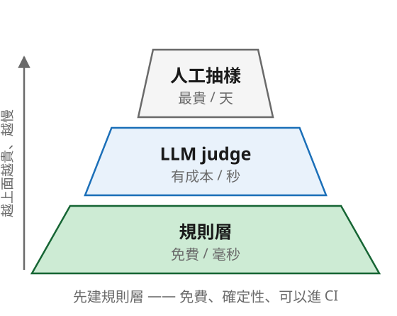
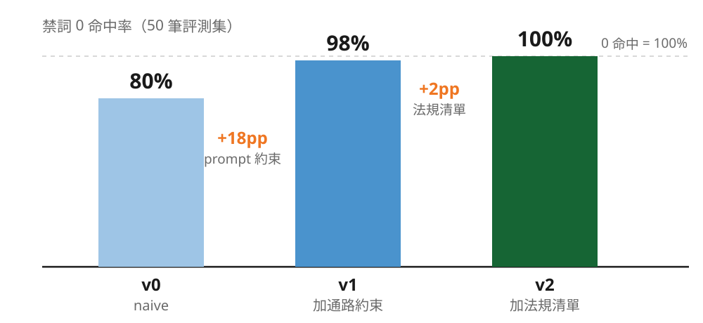
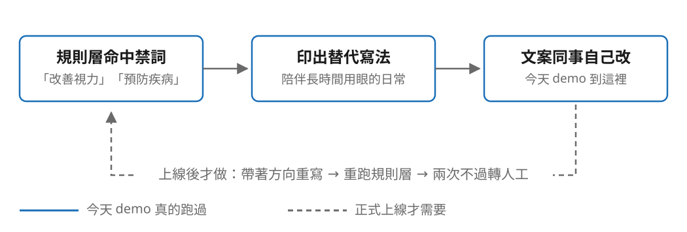
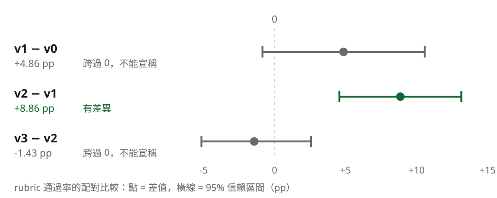

## 三層評測：由便宜到貴，順序很重要

**規則層**　免費、毫秒
長度、格式、禁詞、必含規格

**LLM judge**　有成本、秒
語調、賣點覆蓋

**人工抽樣**　最貴、天
前兩層有分歧的

<!--
銜接：接上一段的「哪一版比較好」—— 這一段就是回答方法。
多數團隊一上來就做 LLM judge，又貴又不穩，然後放棄。
先建規則層：免費、確定性、可以進 CI。順序講清楚再往下。
-->

---

## AI 會寫出違法的話，而且它不知道

| 違規類型 | 法源 | 罰鍰 |
|---|---|---|
| 食品宣稱**醫療效能** | 食安法 §28 II | **NT$ 60 萬 – 500 萬** |
| 食品**不實誇張** | 食安法 §28 I | NT$ 4 萬 – 400 萬 |
| 化粧品**虛偽誇大** | 化粧品衛管法 §10 | NT$ 4 萬 – 20 萬 |

<!--
不要講太快，這頁對創辦人衝擊最大。「最有效」「奇蹟」「逆齡」在台灣是違法的。
關鍵句：AI 不知道它違法了 —— 它照著網路上幾百萬則違規廣告學來的，覺得這樣寫很正常。
這不是工程師的潔癖，是你的公司會不會收到罰單。
只講到「這是規則層要擋的東西」為止。被追問細節就說「商用前要讓法務或法規顧問審過，我這份是簡化示範版」。
-->

---

<!-- _class: center -->

## prompt 只能降低機率，規則層才能給保證

<!--
五分之一踩雷聽起來還好？十萬個 SKU 就是兩萬個。
加了 prompt 約束降到 2% —— 但 2% 不是 0%，十萬 SKU 還是兩千個。
而且 98% 這個數字本身是量出來才知道的：沒有評測，你連自己有沒有 2% 的問題都不知道。
這條線同時證明三件事：AI 真的會違規、prompt 有用但不夠、規則層是必要的。
-->

---

<!-- _class: center -->

## 規則層不只是擋，還能給替代寫法

<!--
今天 demo 就到「印出來、給人看」為止。虛線是上線之後才需要的，不要講成「它會自動改好」。
suggest_fix() 目前只回傳 {禁詞: 替代寫法}，notebook 拿到就 print，沒有任何東西被送回模型。
工程師問「為什麼不乾脆自動回灌」→ 三件事不能省：改完要重檢、不能字串取代（要模型帶著方向重寫，不是 sed）、要設上限（每一輪都是真的錢）。
-->

---

## 第二層：別問「幾分」，問一組 yes / no

| Likert 1–5 的問題 | 後果 |
|---|---|
| 分數擠在 3–4 分 | 看不出差異 |
| 今天 4 分明天 3 分 | 不可重現 |
| 換評審模型整組平移 | 歷史數據作廢 |
| 寫得長、寫得華麗容易得高分 | verbosity bias |
| **「3.8 分」你不知道要改什麼** | **無法行動** |

> 「這份文案幾分？」→ 3.8，然後呢？　「有沒有寫出 30mg？」→ 沒有 → 你知道要補什麼了。

<!--
第二層只評規則層評不了的：語調、賣點覆蓋。
GEAP 的 Gen AI Evaluation Service 把這種判準形容成「像單元測試」，這個比喻很準。
關鍵細節：rubric 從商品資料生成，不是看著文案出題 —— 每個商品出一次，四個版本考同一份考卷。
不然就是每個考生考不同的題目，分數根本不能比。
-->

---

## LLM judge 不是中立的量尺

| 偏誤 | 這個專案的緩解 |
|---|---|
| self-preference（偏好自己的產出） | 評審模型與生成模型刻意選不同的 |
| verbosity（長的容易贏） | 二元判準 +「不因長度加分」明令 |
| position（成對比較先出現的贏） | 改用單篇對照 rubric，不做成對 |
| criteria drift（每次判準不同） | rubric 每商品生成一次，跨版本共用 |

<!--
還是要誠實講：judge 有偏誤。一個會告訴你它什麼時候不準的工具，比一個宣稱永遠準的工具有用。
生成用 flash、評審用 2.5-pro 是刻意的，不要為了省時間改成同一個。
時間壓縮時這頁可以砍，但下一頁不能砍。
-->

---

## 50 筆實測：每一版做對一件事

| | 禁詞 0 命中 | rubric 通過率 | 可直接上架 | 可機器讀取 |
|---|---|---|---|---|
| v0 | 80% | 73.1% | 32% | 0% |
| v1 | **98%** | 78.0% | 48% | 0% |
| v2 | 100% | **86.8%** | **64%** | 0% |
| v3 | 100% | 85.4% | 62% | **100%** |

<!--
數字全部來自 poc/data/eval_results.json，不要改述、不要放寬。
v3 的 rubric 比 v2 低 1.4pp —— 主動指出來，下一頁解釋。
v1 修的是格式與合規，v3 修的是可機器讀取，兩者都不需要檢定就看得出來。
-->

---

<!-- _class: center -->

## 四個版本之間，只有一個差距我敢宣稱

<!--
全場最重要的誠信時刻。主動說「這兩個差距我不能宣稱」比任何漂亮數字更能建立信任。
「分不出差別」不等於「一樣好」，是還沒有證據說誰比較好。
v3 沒有讓文案變好，是讓文案變得可用（可機器讀取 0% → 100%）。
剛好收在主軸上：你要能同時說出「這裡變好了」跟「這裡我還不知道」。
交棒：既然評測可以工程化，那什麼該自己做、什麼該買現成的？
-->
