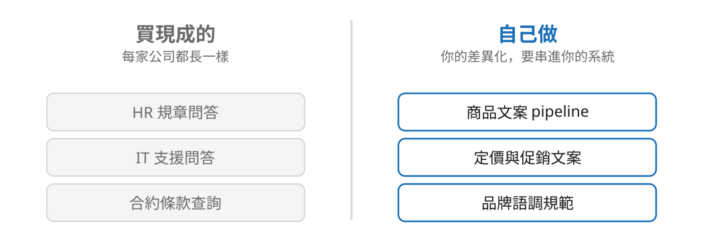
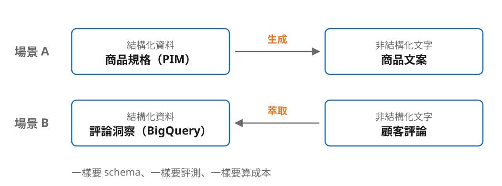

<!-- _class: center -->

## 這個 AI 功能會不會出現在你的產品定價頁上？

**會 → 自己做。不會 → 買現成的。**

<!--
銜接：接上一段的誠信時刻 —— 既然可以量，那什麼該自己量、什麼該外包。
內部知識問答每家公司都長一樣，企業級方案兩週上線，自己做三個月而且做得比較差。
商品文案自己做：它是你的差異化，而且必須串進你的 PIM、上架流程、品牌規範。
判準那句話講完停一拍，這是全場最想被記住的一句話。不主動點名任何產品。
-->

---

<!-- _class: center -->

## 你學到的不是文案技巧，是一套流程

<!--
同一套方法反過來用。場景 B 把評論變成結構化資料進 BigQuery。
容易被忽略的設計：要把「商品不好」和「服務不好」分開 —— 客人抱怨物流慢不是商品問題，
混在一起統計，採購會砍掉一個其實賣得很好的品項。
交棒：那這套流程要花多少錢？　超時直接砍這頁，不影響主論點。
-->
