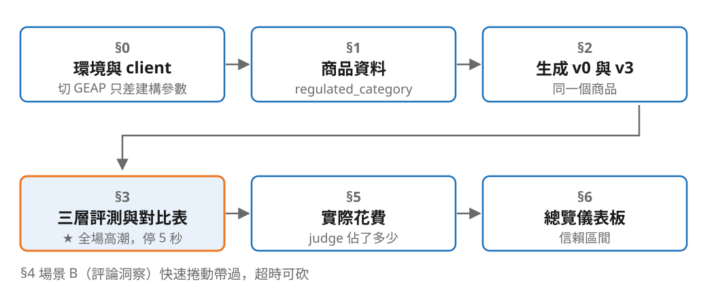

<!-- _class: center -->

## 接下來十分鐘，前面每個數字都會當場跑出來

輸出是昨天錄好的重播 —— 程式碼與評測都是當場執行，只有呼叫模型那一步是查表。

<!--
銜接：接上一段的收尾。離線重播一句話帶過，不要道歉 —— 會場網路我不敢賭。
台下工程師會認同這個判斷；假裝是即時的、被問到才承認才會扣分。
講完立刻切 Colab，不要在投影片上停留。
對比表出現後停 5 秒不要說話。v3 比 v2 低那格要主動講：CI [-5.15, +2.57] 跨過零，還沒有證據。
超時就砍 §4 場景 B。筆電當機切預錄影片（存本機）。
-->

---

## 帶走

- **notebook**：`poc/retail_genai_poc.ipynb` —— 可以直接改，離線重播不需要金鑰
- **repo**：四版 prompt、規則層禁詞清單、judge rubric、成本外推，全部在裡面
- **驗證**：錄製腳本也在 repo 裡，`RECORD_FIXTURES=True` 你自己跑一次會得到同樣的表

<!--
連結留在畫面上直到 QA 結束。
有人問「是不是造假」→ 直接請他自己跑錄製腳本。
最後一句回扣主軸：所以，你怎麼知道它有沒有變好？看那張表。
交棒：進 QA。
-->
