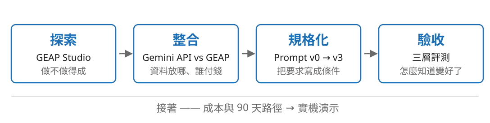
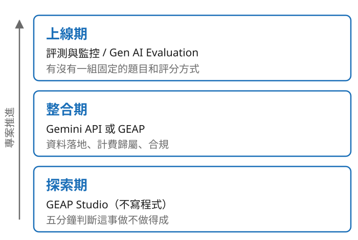
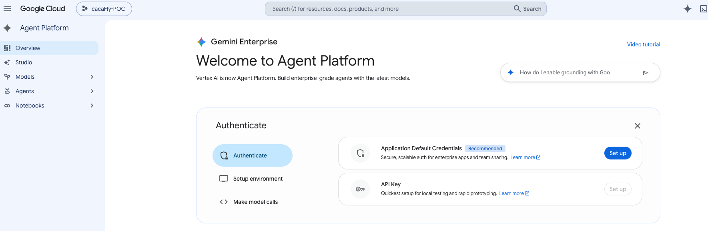
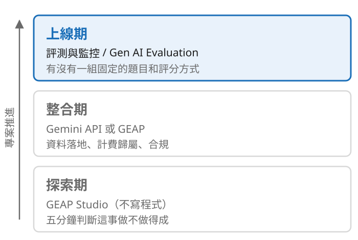
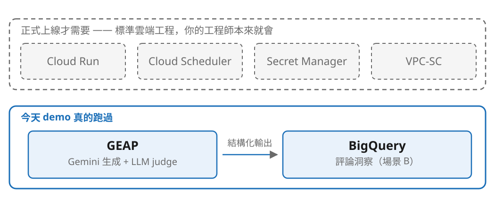

<div class="cols-2">
<div>

**A**

【嚴選】金賺健康 葉黃素軟膠囊 ★熱銷第一★

守護您的靈魂之窗！現代人３Ｃ不離身，眼睛乾澀疲勞好困擾？本產品採用頂級游離型葉黃素，有效改善視力模糊、預防眼部疾病，讓您重拾清晰視界，告別老花困擾！

</div>
<div>

**B**

青研 游離型葉黃素軟膠囊 30粒 每粒30mg

· 游離型葉黃素 30mg，吸收不需再轉換
· 添加玉米黃素與蝦紅素，每日一粒
· 全素可食，無添加人工色素
· 適合長時間使用螢幕的日常保養

</div>
</div>

<!--
銜接：全場第一頁，不自我介紹、不放 logo。
兩段都是 AI 寫的、同一個商品。覺得 A 好的舉手，B 好的舉手 —— 真的等大家舉手，這 30 秒沉默最值錢。
冷場備案：點名兩位聽眾直接問「你選哪個、為什麼」。
不要在這裡講 A 踩了法規 —— 那是第四段的伏筆。投票超過 90 秒就進下一頁。
-->

---

<!-- _class: center -->

# 那你要怎麼跟工程師說：<br>「這版比較好，上線吧」？

你說「感覺比較順」，他問「所以要改哪裡」。下週你們會為了同一件事再吵一次。

<!--
承接上一頁的分歧：分歧不是品味問題，是沒有語言可以描述「好」。
唸完停一拍再翻頁。
-->

---

<!-- _class: center -->

# 生成式 AI 的難處<br>不在叫模型，而在你怎麼知道它有沒有變好

叫模型是十行程式碼，等一下你會看到。難的是後面那件事 —— 而那件事決定你的 POC 能不能變成產品。

<!--
全場只有這一個主張，後面每段結束前回扣一次。
卡住的專案幾乎都不是模型不夠好，是組織裡沒有人能定義什麼叫「好」。
唸完停一拍。自我介紹放在這之後，30 秒，只講與零售／GCP 相關的。
-->

---

<!-- _class: center -->

## 今天四塊內容，是一條因果鏈



<!--
不是四個平行題目：選錯工具 → 規格寫不出來 → 沒東西可驗收。
「你會帶走什麼」用講的：一份可以改的 notebook。不放投影片。
交棒：先講工具，因為選錯工具後面全部白做。
-->

---

## GCP 的 AI 工具，用「你在哪個階段」分

<div class="cols-2-1">
<div>



</div>
<div>

不用產品線分。

同一批模型，三個階段的問題完全不同。

多數人只停在最底下那一層。

</div>
</div>

<!--
銜接：接第一段的因果鏈 —— 先講工具，選錯工具後面全部白做。
不逐一介紹產品。每一層都會用一句「對創辦人而言這代表什麼」收尾。
這頁 60 秒帶過，重點在後面三頁。
-->

---

<!-- _class: center -->

## 探索期：不寫程式，五分鐘知道做不做得成



Vertex AI 於 2026-04 更名 GEAP —— 端點與 SDK 沒動，程式碼一行都不用改。

<!--
第一次講到 GEAP 就交代改名：指著截圖上那句 "Vertex AI is now Agent Platform" 講，比自己說有說服力。
強調程式碼一行都不用改 —— demo 裡 vertexai=True 還在。
對創辦人：這一層你或 PM 自己做，不要先排工程資源。對工程師：prompt 可匯出。
口述鋪下一頁：截圖裡的 Authenticate 卡片，ADC 是 Recommended、API key 標的是 local testing。
-->

---

## 整合期：兩邊是同一批模型，差別在周邊

| | Gemini API（AI Studio key） | GEAP |
|---|---|---|
| 拿到 key | 五秒，網頁點一點 | 要 GCP 專案 + IAM |
| 認證 | API key | 服務帳號 / ADC |
| 計費歸屬 | 個人帳號 | GCP 專案，可進公司帳 |
| 資料落地 / VPC-SC | 較難指定 / ✗ | 可指定 region / ✓ |
| 適合 | 原型、side project | 要跟客戶簽約的正式系統 |

<!--
全段最慢的一頁，給足 3 分鐘。這是最多人搞混的一件事。
關鍵句：切換只差 client 的建構參數，程式碼一行都不用改 —— demo 會看到那三行。
對創辦人：這是部署決策不是技術決策。客戶問「我的資料存在哪」、法務要簽 DPA 時，你要能切到 GEAP。
稽核日誌（Cloud Audit Logs）用講的，沒放表上。不確定的商務條款就說要查，不要編。
-->

---

## 上線期：大部分人跳過的那一層

<div class="cols-2-1">
<div>



</div>
<div>

工具其次。

重點是你有沒有**一組固定的題目**和**一套固定的評分方式**。

</div>
</div>

<!--
這一層跳過的人，三個月後付出代價。
對創辦人：這是你唯一能拿來對董事會證明「有進步」的東西；不然被問「AI 做得怎麼樣了」只能說「感覺不錯」。
刻意留白 —— 不要在這裡開始講評測方法，那是第四段。
-->

---

<!-- _class: center -->

# 同樣的工具，<br>為什麼有人做得起來、有人做不起來？

<!--
交棒：差別在你把哪些要求寫成了條件 —— 下一段講 prompt。
唸完直接翻頁，不要停留解釋。
-->

---

## v0　什麼都不給

<div class="cols-2">
<div>

**v0 prompt**

```
幫我寫這個商品的電商文案。

商品：晨光研選 金盞花萃取
      葉黃素膠囊 60粒
品類：保健食品 / 眼部保養
規格：
  淨含量：60粒 / 盒
  主成分：葉黃素 30mg
  劑型：植物膠囊
```

</div>
<div>

**產出**

```
## 晨光研選｜葉黃素膠囊 文案
### 一、標題與短文案
| 類型 | 文案內容 |
| 主標題 | 高濃度游離型⋯⋯
| 短文案 | 每日一粒，
          告別模糊！⋯⋯
### 二、長文案
您是否面臨這些困擾？⋯⋯
```

</div>
</div>

<!--
銜接：接第二段 —— 差別在你把哪些要求寫成了條件。
兩千多字的 markdown，文筆不差，但沒有一個欄位能塞進商品頁。
關鍵句：「每日一粒，告別模糊」—— 我沒告訴它不能寫，它就自己決定了。
四頁同一個商品 HB-1001，左欄 prompt 右欄產出，都是重播的真實輸出。
-->

---

## v1　加通路約束

<div class="cols-2">
<div>

**v1 新增**

```
你是台灣電商平台的
資深商品文案編輯。
目標受眾：25-45 歲上班族

【格式要求】
- 標題：不超過 60 字
- 賣點：4 條，每條 30 字內
- SEO 描述：不超過 120 字

【必須包含的規格】
葉黃素、60粒、30mg
```

</div>
<div>

**產出**

```
### 商品標題（60 字內）
晨光研選｜高濃度游離型
葉黃素 30mg｜60粒

### 賣點（4 條）
1. 足量高濃度：每粒含
   游離型葉黃素 30mg⋯⋯
2. 黃金比例：5:1 搭配⋯⋯

### SEO 描述（120 字內）
專為長時間使用螢幕的⋯⋯
```

</div>
</div>

<!--
只加一件事：約束。角色、受眾、字數上限、必含規格。
為什麼要字數上限 —— 蝦皮標題 60 字截斷，文案再美被截掉就是廢的。這種事模型不會自己知道。
它照做了：標題、賣點、SEO 分開了。但還是 markdown，語氣也還是那個語氣。
-->

---

## v2　加法規與語調

<div class="cols-2">
<div>

**v2 新增**

```
【法規限制 — 違反會開罰】
本商品受食安法 §28 規範。
不可出現：治療、改善視力、
療效、根治⋯⋯
（依類別帶入，共 93 個禁詞）

【品牌語調】
溫和、專業、不誇大。
以下是本品牌既有的合規
文案，請模仿：
  晨光研選 緩釋B群錠 90錠
  晨光研選 甘胺酸鎂錠 120錠
```

</div>
<div>

**產出**

```
### 商品標題
晨光研選 金盞花游離型
葉黃素膠囊 30mg 60粒

### 賣點（4 條）
1. 足量游離型葉黃素 30mg
2. 葉黃素:玉米黃素 5:1
3. 專為長時間用螢幕設計
4. 每盒 60粒，每日一粒

### 標籤
葉黃素、眼部保養、30mg
```

</div>
</div>

<!--
其實是兩件相關的事：法規禁詞清單，和品牌語調的範例。法規待會兒單獨講。
關鍵句：與其形容「溫和專業」，不如直接給兩則你既有的文案 —— 形容詞模型理解不了，範例它學得會。
對照左邊範例句型與右邊標題句型：同一個句型。我沒有描述任何規則，只給了兩個例子。
-->

---

## v3　結構化輸出

<div class="cols-2">
<div>

**v3 新增：API 參數，prompt 一字未改**

```
response_schema = {
  "title":           str,
  "bullets":         [str],
  "seo_description": str,
  "hashtags":        [str],
}
```

不是在 prompt 裡寫「請輸出 JSON」——
那樣模型會照做九成的時間，剩下一成在你上線之後才出現。

</div>
<div>

**產出**

```
{
  "title": "晨光研選 游離型
    葉黃素膠囊 30mg 60粒",
  "bullets": [
    "游離型葉黃素，好吸收",
    "每粒足量 30mg⋯⋯",
    ⋯⋯共 4 條
  ],
  "seo_description": "⋯⋯",
  "hashtags": ["葉黃素", ⋯]
}
```

</div>
</div>

<!--
模型是被解碼器約束在 schema 內的，不是被你的請求說服的。
QA 防守「schema 是不是連長度也保證了」→ 不是。schema 保證形狀：欄位在、型別對、parser 不會掛。
長度寫在欄位說明裡請模型遵守，是請求不是約束。下一段表上 v3 可機器讀取 100%、賣點長度 98%，差的 2% 就是這個。
左欄刻意只列欄位與型別 —— 不要改成 Field(max_length=60)，那會暗示一個資料證明不存在的保證。
-->

---

## 四個版本，四件事

| 版本 | prompt 多了什麼 | 這一版在解什麼問題 |
|---|---|---|
| v0 | 一句話：幫這個商品寫文案 | 沒有 —— 這是基準線 |
| v1 | 角色、受眾、字數上限、必含規格 | 產出對不上通路的格式要求 |
| v2 | 法規禁詞清單、品牌語調 few-shot | 會踩罰則、語氣不像自家品牌 |
| v3 | responseSchema | 輸出是散文，接不進系統 |

<!--
20 秒快速帶過，講不完直接跳 —— 這頁是幫聽眾整理，不是新論點。
差別不在文筆，在你把哪些要求寫成了條件。每一版只加一件事是刻意的，下一段的改善才歸得了因。
這一段一個通過率都不放。有人先問「哪一版比較好」→「等一下有 50 筆實測的表，先看 prompt 怎麼寫」。
-->

---

<!-- _class: center -->

# 只有 v3 能接進系統。<br>前面三版都只是聊天。

「看起來不錯」跟「能貼進你的 PIM」是兩件不同的事。

<!--
交棒：現在有四個版本了 —— 哪個比較好？你怎麼證明？
下一段就是回答方法。
-->

---

## 三層評測：由便宜到貴，順序很重要

<div class="cols-2">
<div>


</div>
<div>

**規則層**　免費、毫秒
長度、格式、禁詞、必含規格

**LLM judge**　有成本、秒
語調、賣點覆蓋

**人工抽樣**　最貴、天
前兩層有分歧的

</div>
</div>

<!--
銜接：接上一段的「哪一版比較好」—— 這一段就是回答方法。
多數團隊一上來就做 LLM judge，又貴又不穩，然後放棄。
先建規則層：免費、確定性、可以進 CI。順序講清楚再往下。
-->

---

## AI 會寫出違法的話，而且它不知道

| 違規類型 | 法源 | 罰鍰 |
|---|---|---|
| 食品宣稱**醫療效能** | 食安法 §28 II | **NT$ 60 萬 – 500 萬** |
| 食品**不實誇張** | 食安法 §28 I | NT$ 4 萬 – 400 萬 |
| 化粧品**虛偽誇大** | 化粧品衛管法 §10 | NT$ 4 萬 – 20 萬 |

<!--
不要講太快，這頁對創辦人衝擊最大。「最有效」「奇蹟」「逆齡」在台灣是違法的。
關鍵句：AI 不知道它違法了 —— 它照著網路上幾百萬則違規廣告學來的，覺得這樣寫很正常。
這不是工程師的潔癖，是你的公司會不會收到罰單。
只講到「這是規則層要擋的東西」為止。被追問細節就說「商用前要讓法務或法規顧問審過，我這份是簡化示範版」。
-->

---

<!-- _class: center -->

## prompt 只能降低機率，規則層才能給保證


<!--
五分之一踩雷聽起來還好？十萬個 SKU 就是兩萬個。
加了 prompt 約束降到 2% —— 但 2% 不是 0%，十萬 SKU 還是兩千個。
而且 98% 這個數字本身是量出來才知道的：沒有評測，你連自己有沒有 2% 的問題都不知道。
這條線同時證明三件事：AI 真的會違規、prompt 有用但不夠、規則層是必要的。
-->

---

<!-- _class: center -->

## 規則層不只是擋，還能給替代寫法


<!--
今天 demo 就到「印出來、給人看」為止。虛線是上線之後才需要的，不要講成「它會自動改好」。
suggest_fix() 目前只回傳 {禁詞: 替代寫法}，notebook 拿到就 print，沒有任何東西被送回模型。
工程師問「為什麼不乾脆自動回灌」→ 三件事不能省：改完要重檢、不能字串取代（要模型帶著方向重寫，不是 sed）、要設上限（每一輪都是真的錢）。
-->

---

## 第二層：別問「幾分」，問一組 yes / no

| Likert 1–5 的問題 | 後果 |
|---|---|
| 分數擠在 3–4 分 | 看不出差異 |
| 今天 4 分明天 3 分 | 不可重現 |
| 換評審模型整組平移 | 歷史數據作廢 |
| 寫得長、寫得華麗容易得高分 | verbosity bias |
| **「3.8 分」你不知道要改什麼** | **無法行動** |

> 「這份文案幾分？」→ 3.8，然後呢？　「有沒有寫出 30mg？」→ 沒有 → 你知道要補什麼了。

<!--
第二層只評規則層評不了的：語調、賣點覆蓋。
GEAP 的 Gen AI Evaluation Service 把這種判準形容成「像單元測試」，這個比喻很準。
關鍵細節：rubric 從商品資料生成，不是看著文案出題 —— 每個商品出一次，四個版本考同一份考卷。
不然就是每個考生考不同的題目，分數根本不能比。
-->

---

## LLM judge 不是中立的量尺

| 偏誤 | 這個專案的緩解 |
|---|---|
| self-preference（偏好自己的產出） | 評審模型與生成模型刻意選不同的 |
| verbosity（長的容易贏） | 二元判準 +「不因長度加分」明令 |
| position（成對比較先出現的贏） | 改用單篇對照 rubric，不做成對 |
| criteria drift（每次判準不同） | rubric 每商品生成一次，跨版本共用 |

<!--
還是要誠實講：judge 有偏誤。一個會告訴你它什麼時候不準的工具，比一個宣稱永遠準的工具有用。
生成用 flash、評審用 2.5-pro 是刻意的，不要為了省時間改成同一個。
時間壓縮時這頁可以砍，但下一頁不能砍。
-->

---

## 50 筆實測：每一版做對一件事

| | 禁詞 0 命中 | rubric 通過率 | 可直接上架 | 可機器讀取 |
|---|---|---|---|---|
| v0 | 80% | 73.1% | 32% | 0% |
| v1 | **98%** | 78.0% | 48% | 0% |
| v2 | 100% | **86.8%** | **64%** | 0% |
| v3 | 100% | 85.4% | 62% | **100%** |

<!--
數字全部來自 poc/data/eval_results.json，不要改述、不要放寬。
v3 的 rubric 比 v2 低 1.4pp —— 主動指出來，下一頁解釋。
v1 修的是格式與合規，v3 修的是可機器讀取，兩者都不需要檢定就看得出來。
-->

---

<!-- _class: center -->

## 四個版本之間，只有一個差距我敢宣稱


<!--
全場最重要的誠信時刻。主動說「這兩個差距我不能宣稱」比任何漂亮數字更能建立信任。
「分不出差別」不等於「一樣好」，是還沒有證據說誰比較好。
v3 沒有讓文案變好，是讓文案變得可用（可機器讀取 0% → 100%）。
剛好收在主軸上：你要能同時說出「這裡變好了」跟「這裡我還不知道」。
交棒：既然評測可以工程化，那什麼該自己做、什麼該買現成的？
-->

---

<!-- _class: center -->

## 這個 AI 功能會不會出現在你的產品定價頁上？


**會 → 自己做。不會 → 買現成的。**

<!--
銜接：接上一段的誠信時刻 —— 既然可以量，那什麼該自己量、什麼該外包。
內部知識問答每家公司都長一樣，企業級方案兩週上線，自己做三個月而且做得比較差。
商品文案自己做：它是你的差異化，而且必須串進你的 PIM、上架流程、品牌規範。
判準那句話講完停一拍，這是全場最想被記住的一句話。不主動點名任何產品。
-->

---

<!-- _class: center -->

## 你學到的不是文案技巧，是一套流程


<!--
同一套方法反過來用。場景 B 把評論變成結構化資料進 BigQuery。
容易被忽略的設計：要把「商品不好」和「服務不好」分開 —— 客人抱怨物流慢不是商品問題，
混在一起統計，採購會砍掉一個其實賣得很好的品項。
交棒：那這套流程要花多少錢？　超時直接砍這頁，不影響主論點。
-->

---

## 公式不會過期，價格會

<div class="rows-2">
<div>

```
單次成本 =（input_tokens × 單價_in + output_tokens × 單價_out）÷ 1,000,000

月成本   = 單次 × SKU 數 × 每 SKU 重生成次數 ×（1 + judge 開銷比）
```

</div>
<div>

<span class="accent">評測本身要花錢</span>，而且評審模型通常比生成模型貴 —— 這是最常被漏算的一筆。

</div>
</div>

<!--
銜接：接上一段 —— 那這套流程要花多少錢？
為什麼投影片上不寫價格數字：模型和價格每季都在動，今天寫上去下個月就過期，你們會拿著錯的數字做預算。
金額只唸 demo 當場印出來的，不要唸投影片上不存在的數字。
judge 佔比等 demo 的 §5 當場看。
-->

---

## 降本四招

| 招 | 省下 | 代價 |
|---|---|---|
| **模型選型降級** | 通常最大一筆 | **要有評測表才敢降，否則是在賭** |
| Batch API | 約 5 折 | 延遲變小時級（文案本來就不急） |
| Context caching | input token 大幅折扣 | 有門檻，前綴要夠長 |
| 結果快取 | 最被低估的一招 | 幾乎沒有 |

<!--
第一招特別講：這就是評測的商業價值 —— 它不只是品管，它是你敢不敢省錢的依據。
沒有評測表你不敢降；有評測表，降完跑一次就知道品質掉了沒有。
最後一招最被低估：商品規格沒變就不要重新生成。很多團隊每天全量重跑，九成商品根本沒動過。
-->

---

<!-- _class: center -->

## 這套東西到底用到哪些 GCP？



<!--
這頁是預防針。不主動講，QA 一定有人問「這跟 GCP 有什麼關係」，被動回答會顯得心虛。
誠實說：今天 demo 只真的用到兩個服務。這是刻意的 —— 先把「怎麼知道它變好了」解決掉，再談怎麼部署。
順序反過來的專案，通常上線後才發現沒人能判斷好壞，回頭補評測成本高得多。
虛線那些都是標準雲端工程，你的工程師本來就會；真正難的是實線那兩個框裡面發生的事。
-->

---

## 90 天導入路徑

| 階段 | 時間 | 產出 |
|---|---|---|
| Studio 驗證可行性 | 2 週 | 這事到底做不做得成 |
| 建 golden set + API 串接 | 4 週 | **30–50 筆就足以開始** |
| 小流量上線 + 監控 | 6 週 | 有數字可以對董事會報告 |

<!--
常有人問 golden set 要多大 —— 30 到 50 筆就可以開始。
不要因為湊不到一千筆就不開始：五十筆已經足以讓你看出改動有沒有讓事情變糟。
每個階段都要說得出「誰負責」。
-->

---

## 回到一開始那兩段文案

<div class="cols-2">
<div>

**A**　守護您的靈魂之窗！⋯⋯有效改善視力模糊、預防眼部疾病⋯⋯

**B**　游離型葉黃素 30mg，吸收不需再轉換／適合長時間使用螢幕的日常保養

現在你說得出哪個比較好，而且你能證明 —— 不是「感覺比較順」，是一張表。

</div>
<div>

**帶回去三件事**

1. 先建規則層，它免費
2. 用 API 原生的 structured output，不要用 prompt 硬凹
3. 評測本身要花錢，記得算進去

</div>
</div>

<!--
三件事要唸得慢。第一件事回收 80% → 98% → 100% 那條線：prompt 只能降低機率，規則層才能給保證。
第三件事回收 demo 會印出的 judge 佔比。
更重要的是：下次你換模型、改 prompt、為了省錢降級，重跑一次就知道有沒有退步。這才是能上線的東西。
交棒：「謝謝。接下來我實際跑給大家看。」—— 收尾之後才進 demo，順序不要顛倒。
-->

---

<!-- _class: center -->

## 接下來十分鐘，前面每個數字都會當場跑出來


輸出是昨天錄好的重播 —— 程式碼與評測都是當場執行，只有呼叫模型那一步是查表。

<!--
銜接：接上一段的收尾。離線重播一句話帶過，不要道歉 —— 會場網路我不敢賭。
台下工程師會認同這個判斷；假裝是即時的、被問到才承認才會扣分。
講完立刻切 Colab，不要在投影片上停留。
對比表出現後停 5 秒不要說話。v3 比 v2 低那格要主動講：CI [-5.15, +2.57] 跨過零，還沒有證據。
超時就砍 §4 場景 B。筆電當機切預錄影片（存本機）。
-->

---

## 帶走

- **notebook**：`poc/retail_genai_poc.ipynb` —— 可以直接改，離線重播不需要金鑰
- **repo**：四版 prompt、規則層禁詞清單、judge rubric、成本外推，全部在裡面
- **驗證**：錄製腳本也在 repo 裡，`RECORD_FIXTURES=True` 你自己跑一次會得到同樣的表

<!--
連結留在畫面上直到 QA 結束。
有人問「是不是造假」→ 直接請他自己跑錄製腳本。
最後一句回扣主軸：所以，你怎麼知道它有沒有變好？看那張表。
交棒：進 QA。
-->
