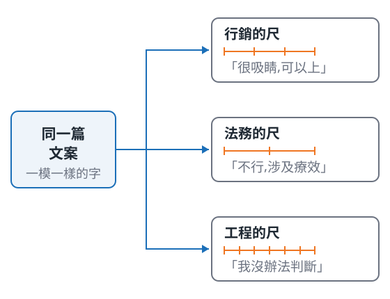

<!-- _class: title -->

# 你怎麼知道它變好了?

一條零售文案 pipeline 的四次改版

新創加速器 · 2026-08-21

<!--
不自我介紹,第一句就是「先請大家做一件事」。
30 秒帶過,張力留給下一頁的投票。
-->

---

## 同一個商品,兩篇文案 —— 你會放上架哪一篇?

### A 版

💧 **告別乾荒!五重玻尿酸深度補水,敷出水光肌的秘密武器**

- 上妝容易卡粉、浮粉,底妝不服貼?
- 換季時肌膚特別敏感,擦什麼都不夠力?
- 👉 缺水,是所有肌膚問題的根源!

### B 版

**青研 CHINGYEN 多重玻尿酸保濕面膜 5片入｜五重玻尿酸精華 敏弱肌適用**

- 五重玻尿酸配方,層層補水,維持肌膚水嫩
- 採用輕薄服貼的天絲蠶絲膜布,親膚透氣
- 溫和成分,質地清爽,乾燥敏弱肌適用

<!--
先請覺得 A 好的舉手,再請 B,最後問「兩篇都不敢上架的」— 第三個一定有人舉手,那是伏筆。
關鍵句不能省:同一個模型、同一批商品資料,只有 prompt 不同。
投票最多 2 分鐘,超過直接翻頁。
-->

---

## 你們分裂了,而且每個人的理由都對

分歧不是因為誰眼光比較好,是因為在場**沒有人拿著同一把尺**。

真正難的是這三個問題:

- 「好」的定義是什麼?
- 誰來判?
- 判完之後,你敢不敢上架?

<!--
先讓圖說話(三個角色三個結論),再落到三問。
三問是並列的,不要唸成「第一第二第三」— 那會暗示有先後。
約 70 秒。
-->

---

<!-- _class: center -->

## <u>難的不是叫模型,是你怎麼知道它有沒有變好</u>

接下來的時間,我們就一起看這件事

<!--
全場唯一要記得的一件事,講完停兩秒。
語氣放平,不要講成宣示 — 這句話後面還有 35 分鐘要拿證據撐。
交棒:「從我怎麼改 prompt 開始。」
-->
