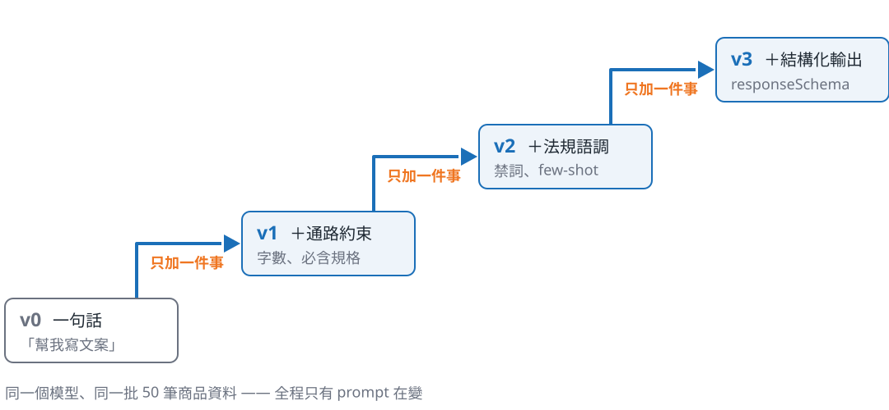

<!-- _class: divider bg-none -->

# 四版 prompt

每一版只加一件事 —— 這樣後面的數字才歸因得回去

<!--
銜接:剛才那兩篇,A 版就是這樣來的。
15 秒帶過,不要在轉場頁停留。
-->

---

## Prompt 不是咒語,是規格書

你寫的不是給模型的**咒語**,是給承包商的**規格書**。

- 規格書上沒寫的東西,不要期待它會出現
- 規格書上寫錯的東西,它會照著做給你看

<!--
比喻先講完再進版本 — 這是全段的骨架。
「沒寫的不會出現」是後面每一版新增項的解釋方式。
約 60 秒。
-->

---

## 四版,每版只加一件事



<!--
照階梯由左下往右上唸,每一階只講「加了什麼」,不講效果 — 效果留給下一頁與 section-04。
強調底部那行:全程只有 prompt 在變。
約 80 秒。
-->

---

## v1 修好的是「可上架」,不是「寫得好」

| 規則層指標 | v0 | v1 |
|---|---|---|
| 標題長度合規 | 74% | <span class="accent">100%</span> |
| 規格完整覆蓋 | 82% | 98% |
| 法規禁詞 0 命中 | 80% | 98% |

v1 加的是字數與必含規格 —— 禁詞的改善是**副作用**,不是設計。

<!--
50 筆商品的實測值,不要講成「大約」。
禁詞那一列一定要說是副作用 — 文案變短自然少講大話,不是 v1 管了法規。
約 70 秒。
-->

---

## 在 prompt 裡禁止,不等於它不會出現

<div class="cols-2-1">

<div>

### v2 加了兩件事

- **禁詞清單**(依商品的法規分類帶入)
- **品牌語調 few-shot**(拿既有合規文案當範例)

</div>

<div>

### 但那不是保證

法規禁詞 0 命中率
v1 98% → v2 100%

這個 100% 是 50 筆跑出來的結果。

</div>

</div>

prompt 裡的禁令是一個**請求**,不是一道**閘**。

<!--
兩件事分開講,不要黏成一句:禁詞是「不能寫什麼」,語調是「要怎麼寫」。
禁詞清單依商品的法規分類動態帶入 — 保健食品走食安法、化粧品走化粧品法,兩份清單不一樣。
few-shot 首現,白話講一次:拿自己家已經合規的文案給模型照著寫。
不要強調那個 100% — 這頁的論點正好是「這個 100% 不能當保證」,右欄唸完就把重量交給底下那句。
「請求不是閘」是本頁重點,也是下一段規則層存在的理由,講完停一下。
約 60 秒。
-->

---

<!-- _class: tech -->
<!-- _header: 技術頁 -->

## v3 的重點不在 prompt 多寫一句話

<div class="cols-2">

<div>

### 在 prompt 裡拜託它

```text
請直接輸出 JSON,
不要加 markdown 標記
```

第 1 筆會成功。
第 200 筆會多一個 ```` ```json ````,
然後你的 parser 就掛了。

</div>

<div>

### 在 API 掛上 schema

```python
config = GenerateContentConfig(
    response_mime_type="application/json",
    response_schema=COPY_SCHEMA,
)
```

**responseSchema**(API 原生的輸出格式約束)
把模型限制在 schema 內。

可機器讀取:<span class="accent">0% → 100%</span>

</div>

</div>

<!--
本段唯一技術頁,工程師會想追問 function calling — 說「QA 再展開」。
關鍵措辭:schema 保證形狀,不保證內容長度好不好。
約 100 秒,是本段最長的一頁。
-->

---

## 為什麼堅持一次只加一件事?

一次改三件事,然後看到分數上升 —— 你不知道該保留哪一件,也不知道該回退哪一件。

一次只改一件事,四個版本之間就只有**一個變因**;等一下量出來的差異,才有地方可以歸因。

這四版是我的 **git log**(prompt 的改動紀錄),不是給你的 **SOP** —— 你上線就用第四版;哪一類破了,才回來一次改一件事。

<!--
這頁是本段結論,也是 section-04 的前提。
第三句是防誤解用的,一定要講 — 台下最容易帶走的錯誤結論是「原來我要從 v0 開始爬」。沒有人刻意先寫爛 prompt。
被追問「換一個產品要不要重跑一次 v0?」:不用。可複用的是四類約束(通路/法規/語調/結構化輸出),要換的是禁詞清單、字數預算、few-shot 範例。
交棒:「四個版本擺在這裡了 — 現在問題回到剛才:你要拿什麼去量它們?」
約 60 秒。
-->
