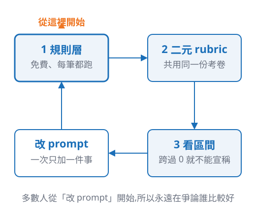

<!-- _class: divider bg-none -->

# 你的第一個評測迴圈

明天早上可以開的第一個 ticket

<!--
銜接:接上一段的「從哪一步開始?」— 第一句「從最便宜的那一層開始。」
15 秒。
-->

---

## 三步驟,順序不能顛倒

1. **先寫規則層** —— 免費、毫秒級,而且它擋的是罰款這種不可逆的風險
2. **再寫二元 rubric** —— 從你的商品資料生成,所有版本共用同一份
3. **最後才比版本** —— 而且一次只改一件事

多數人是從第 3 步開始做的,所以永遠停在爭論誰比較好。

<!--
本段重點頁。三步驟講順序,不要講內容 — 內容前面都講過了。
被問「我不是做零售文案」:三步驟與領域無關,只有規則層的規則來源會變。
約 100 秒。
-->

---

## 生成的東西不好,先分辨是哪一種

### 壞 1 篇

手改那一篇。同一個 prompt 重跑一次就是另一篇 —— 一篇壞掉多半是抽到的,不是 prompt。

### 壞 12 篇,同一處

那是**規格缺口**:改 prompt,重跑整批。

寫進去了還是漏,就不是 prompt 的事 —— 那一條交給規則層。

### 每篇都「不算壞」

你還沒有尺。拿 5 篇喜歡的、5 篇不喜歡的,把差別寫成一題是非題。

「不好就重生」不是**流程**,是**拉霸** —— 分不出哪一種,就只能一直拉。

<!--
這頁是給創辦人的,全段最實用的一頁,超時也不要砍。
順序照左中右講,不要跳:先數數量,再看是不是同一種壞法,最後才輪到「說不出來」。
第三欄就是開場投票那件事 — 說「這就是剛才你們舉手分裂的原因,那不是模型的問題,是還沒有尺」。
第二欄的第二句是回扣 v2 的「請求不是閘」,講到這裡可以停半秒。
被問溫度:溫度只管用字變化,管不了合規;要可重現是把輸出存起來,不是把溫度調到 0。展開留 QA。
約 60 秒。
-->

---

## 什麼時候該停下來收數據?

當你**說不出下一版要加的是哪一件事**的時候。

說不出來,就代表你在猜;猜出來的改動,即使分數上升也歸因不了 —— 那只是把雜訊當成進步。

- 停止條件不是「分數不再上升」,那會鼓勵你去追雜訊

<!--
這是最容易被誤記的一句,講完停一下。
本段超時砍的是這頁(移到 QA),不是前一頁的三種壞法。
約 55 秒。
-->

---

## 成本怎麼算

### 生成

版本數 × 商品數 × 每次生成的 token 單價

### 產生 rubric

商品數 × 每份考卷的 token 單價,四版共用同一份

### 逐條檢查

版本數 × 商品數 × 每條判準的 token 單價

三段加起來就是一輪評測的成本。你能動的變數只有兩個:**跑幾個版本**、**評測集多大**。

<!--
講算法不講金額 — 單價會隨模型與時間變,寫死在投影片上只會過期。
三段的拆法跟 notebook §6 的環圈圖一致,現場想看實際金額就開那一格。
逐條檢查通常是三段裡最大的一塊,值得提一句。
約 60 秒。
-->

---

<!-- _class: center -->

## 回到開場那兩篇文案

你現在還是可能選 A,也可能選 B —— 那沒關係。

差別在於,你手上多了一把尺,而且你說得出它量的是什麼。

<u>難的不是叫模型,是你怎麼知道它有沒有變好</u>

<!--
全場最後一頁,收在核心訊息,與開場第 4 頁同一句話。
講完停兩秒再接 QA,不要急著說謝謝。
約 40 秒。
-->
