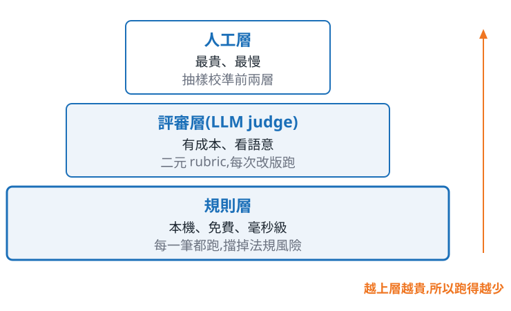

<!-- _class: title -->

# 你怎麼知道它變好了?

一條零售文案 pipeline 的四次改版

新創加速器 · 2026-08-21

<!--
不自我介紹,第一句就是「先請大家做一件事」。
30 秒帶過,張力留給下一頁的投票。
-->

---

## 同一個商品,兩篇文案 —— 你會放上架哪一篇?

<div class="cols-2">

<div>

### A 版

💧 **告別乾荒!五重玻尿酸深度補水,敷出水光肌的秘密武器**

- 上妝容易卡粉、浮粉,底妝不服貼?
- 換季時肌膚特別敏感,擦什麼都不夠力?
- 👉 缺水,是所有肌膚問題的根源!

</div>

<div>

### B 版

**青研 CHINGYEN 多重玻尿酸保濕面膜 5片入｜五重玻尿酸精華 敏弱肌適用**

- 五重玻尿酸配方,層層補水,維持肌膚水嫩
- 採用輕薄服貼的天絲蠶絲膜布,親膚透氣
- 溫和成分,質地清爽,乾燥敏弱肌適用

</div>

</div>

<!--
先請覺得 A 好的舉手,再請 B,最後問「兩篇都不敢上架的」— 第三個一定有人舉手,那是伏筆。
關鍵句不能省:同一個模型、同一批商品資料,只有 prompt 不同。
投票最多 2 分鐘,超過直接翻頁。
-->

---

## 你們分裂了,而且每個人的理由都對

<div class="cols-2">

<div>


</div>

<div>

分歧不是因為誰眼光比較好,是因為在場**沒有人拿著同一把尺**。

真正難的是這三個問題:

- 「好」的定義是什麼?
- 誰來判?
- 判完之後,你敢不敢上架?

</div>

</div>

<!--
先讓圖說話(三個角色三個結論),再落到三問。
三問是並列的,不要唸成「第一第二第三」— 那會暗示有先後。
約 70 秒。
-->

---

<!-- _class: center -->

## <u>難的不是叫模型,是你怎麼知道它有沒有變好</u>

接下來的時間,我們就一起看這件事

<!--
全場唯一要記得的一件事,講完停兩秒。
語氣放平,不要講成宣示 — 這句話後面還有 35 分鐘要拿證據撐。
交棒:「從我怎麼改 prompt 開始。」
-->

---

<!-- _class: divider bg-none -->

# 四版 prompt

每一版只加一件事 —— 這樣後面的數字才歸因得回去

<!--
銜接:剛才那兩篇,A 版就是這樣來的。
15 秒帶過,不要在轉場頁停留。
-->

---

## Prompt 不是咒語,是規格書

你寫的不是給模型的**咒語**,是給承包商的**規格書**。

- 規格書上沒寫的東西,不要期待它會出現
- 規格書上寫錯的東西,它會照著做給你看

<!--
比喻先講完再進版本 — 這是全段的骨架。
「沒寫的不會出現」是後面每一版新增項的解釋方式。
約 60 秒。
-->

---

## 四版,每版只加一件事


<!--
照階梯由左下往右上唸,每一階只講「加了什麼」,不講效果 — 效果留給下一頁與 section-04。
強調底部那行:全程只有 prompt 在變。
約 80 秒。
-->

---

## v1 修好的是「可上架」,不是「寫得好」

| 規則層指標 | v0 | v1 |
|---|---|---|
| 標題長度合規 | 74% | <span class="accent">100%</span> |
| 規格完整覆蓋 | 82% | 98% |
| 法規禁詞 0 命中 | 80% | 98% |

v1 加的是字數與必含規格 —— 禁詞的改善是**副作用**,不是設計。

<!--
50 筆商品的實測值,不要講成「大約」。
禁詞那一列一定要說是副作用 — 文案變短自然少講大話,不是 v1 管了法規。
約 70 秒。
-->

---

## 在 prompt 裡禁止,不等於它不會出現

<div class="cols-2-1">

<div>

### v2 加了兩件事

- **禁詞清單**(依商品的法規分類帶入)
- **品牌語調 few-shot**(拿既有合規文案當範例)

</div>

<div>

### 但那不是保證

法規禁詞 0 命中率
v1 98% → v2 100%

這個 100% 是 50 筆跑出來的結果。

</div>

</div>

prompt 裡的禁令是一個**請求**,不是一道**閘**。

<!--
兩件事分開講,不要黏成一句:禁詞是「不能寫什麼」,語調是「要怎麼寫」。
禁詞清單依商品的法規分類動態帶入 — 保健食品走食安法、化粧品走化粧品法,兩份清單不一樣。
few-shot 首現,白話講一次:拿自己家已經合規的文案給模型照著寫。
不要強調那個 100% — 這頁的論點正好是「這個 100% 不能當保證」,右欄唸完就把重量交給底下那句。
「請求不是閘」是本頁重點,也是下一段規則層存在的理由,講完停一下。
約 60 秒。
-->

---

<!-- _class: tech -->
<!-- _header: 技術頁 -->

## v3 的重點不在 prompt 多寫一句話

<div class="cols-2">

<div>

### 在 prompt 裡拜託它

```text
請直接輸出 JSON,
不要加 markdown 標記
```

第 1 筆會成功。
第 200 筆會多一個 ```` ```json ````,
然後你的 parser 就掛了。

</div>

<div>

### 在 API 掛上 schema

```python
config = GenerateContentConfig(
    response_mime_type="application/json",
    response_schema=COPY_SCHEMA,
)
```

**responseSchema**(API 原生的輸出格式約束)
把模型限制在 schema 內。

可機器讀取:<span class="accent">0% → 100%</span>

</div>

</div>

<!--
本段唯一技術頁,工程師會想追問 function calling — 說「QA 再展開」。
關鍵措辭:schema 保證形狀,不保證內容長度好不好。
約 100 秒,是本段最長的一頁。
-->

---

## 為什麼堅持一次只加一件事?

一次改三件事,然後看到分數上升 —— 你不知道該保留哪一件,也不知道該回退哪一件。

一次只改一件事,四個版本之間就只有**一個變因**;等一下量出來的差異,才有地方可以歸因。

這四版是我的 **git log**(prompt 的改動紀錄),不是給你的 **SOP** —— 你上線就用第四版;哪一類破了,才回來一次改一件事。

<!--
這頁是本段結論,也是 section-04 的前提。
第三句是防誤解用的,一定要講 — 台下最容易帶走的錯誤結論是「原來我要從 v0 開始爬」。沒有人刻意先寫爛 prompt。
被追問「換一個產品要不要重跑一次 v0?」:不用。可複用的是四類約束(通路/法規/語調/結構化輸出),要換的是禁詞清單、字數預算、few-shot 範例。
交棒:「四個版本擺在這裡了 — 現在問題回到剛才:你要拿什麼去量它們?」
約 60 秒。
-->

---

<!-- _class: divider bg-none -->

# 三層評測

把「好」變成可以量的東西

<!--
銜接:接上一段的「你要拿什麼去量它們?」— 第一句「我用三層尺。」
15 秒帶過。
-->

---

## 三層,越下層越便宜,所以越該多跑

<div class="cols-2-1">

<div>



</div>

<div>

三層各有各的工作:

- 規則層管**確定性**
- 評審層管**語意**
- 人工層管**校準**

只做上面那層,你會破產;只做下面那層,你量不到文案寫得好不好。

</div>

</div>

<!--
由下而上唸,先講規則層 — 那是唯一免費的一層。
右側三點各一句就好,細節留給後面三頁。
約 70 秒。
-->

---

## 免費的那一層,擋掉的是最貴的風險

保健食品受《食品安全衛生管理法》第 28 條規範,宣稱醫療效能罰
<span class="accent">NT$60 萬–500 萬</span>。

✗ 「幫助改善睡眠品質,揮別長期失眠困擾」
✓ 「每份含 300mg 檸檬酸鈣,睡前 30 分鐘食用」

禁詞清單依商品的法規分類動態套用 —— 保健食品與化粧品的法源不同,罰則也不同。

<!--
開頭回扣上一段:prompt 裡的禁令是請求不是閘,所以這一層才要真的去驗。
罰則的下限也要講,不要只說「最高 500 萬」。
化粧品是《化粧品衛生安全管理法》§10,罰 4-20 萬,不要混講成 500 萬。
這一層是免費的,所以沒有理由不做 — 這句是本頁的結論。
約 90 秒,本段最重的一頁。
-->

---

<!-- _class: tech -->
<!-- _header: 技術頁 -->

## 二元 rubric:只問是或否

<div class="cols-2">

<div>

### 用 1–5 分

- 分數全部擠在 3～4 分之間
- 換一個模型,整批分數就平移
- 「這篇 3.8 分」—— 然後呢?

</div>

<div>

### 用二元 rubric

- **二元 rubric** = 每題只能答是或否的考卷
- 「文案有沒有寫出 30mg?」→ 是 / 否
- 每一個「否」都直接是一張待辦

</div>

</div>

<!--
重點措辭:不是二分法評分,是二元判準。
1-5 分不是錯,是無法行動 — 這句要講清楚,台下會有人用 Likert。
約 80 秒。
-->

---

<!-- _class: tech -->
<!-- _header: 技術頁 -->

## 讓評測本身站得住的兩條紀律

1. **同一份考卷** —— rubric 只從商品資料生成,v0～v3 共用
   讓評審看著文案即興出題,等於每個版本考不同的卷子,分數就不能比
2. **不同模型** —— 生成用 flash、評審用 2.5-pro
   降低 **self-preference bias**(模型偏袒自己寫出來的東西)

<!--
兩點有優先序:同一份考卷是前提,不同模型是優化。
超時就砍第 2 點,留給 QA。
約 70 秒。
-->

---

## 同一批文案,換一份考卷,結論就相反

兩份考卷的差別只有一項:**有沒有把通路的字數上限告訴它**。

| rubric 通過率 | v0(prompt 只有一句話) | v3(prompt 寫了完整規格) |
|---|---|---|
| 沒說字數上限 | <span class="accent">100%</span> | 57% |
| 說了字數上限 | 73.1% | 85.4% |

<span class="caption">通過率 = 50 筆文案裡通過 rubric 判準的比例;兩列是同一批文案。</span>

<!--
自白用講的,不印在投影片上:這份考卷是我產的,我忘了把通路的字數上限帶進去。
錯法具體長這樣:跑出「說明為何隨餐吃更好」這種判準 — 30 字的賣點根本塞不下,寫得冗長的反而得分。
先講通過率的定義,再看表:上面那列說 v0 比較好,下面那列說 v3 比較好,文案一個字都沒變。
講完停一下,再收:所以評測本身也是要被評測的 — 這就是下一頁人工層存在的理由。
約 90 秒。
-->

---

## 人工層不是用來評全部的

- 人工只抽樣,負責回答「前兩層有沒有在量錯的東西」
- 規則層與評審層跑完的結果,要有人定期回頭看一眼

<u>三層都是為了同一件事:讓「變好了」這句話有依據</u>

<!--
本頁是喘息頁,不帶新概念,回扣核心訊息。
交棒:「尺有了,四個版本也量完了 — 我們來看量出來長什麼樣。」
約 45 秒。
-->

---

## 四個版本,量出來長這樣

| | v0 | v1 | v2 | v3 |
|---|---|---|---|---|
| rubric 通過率 | 73.1% | 78.0% | 86.8% | 85.4% |
| 可機器讀取 | 0% | 0% | 0% | 100% |

這些百分比都帶著誤差,不過**誤差不影響哪一版比較好的判斷** —— v2 那一格是真的往上走了。

<!--
銜接:接上一段的「尺有了,四個版本也量完了」。
誤差用講的帶過,不上投影片:算過信賴區間,v2 那一版的改善站得住,v1 與 v3 的差距還在雜訊裡。
v3 的說法要對:它沒有讓文案變好,是讓文案變得可用(0% → 100%),與 section-02 一致。
交棒:「講到這裡都還是投影片 — 接下來我實際跑一次給大家看。」
約 2 分鐘。
-->

---

<!-- _class: divider bg-none -->

# 實機跑一次

同一份程式碼、同一批資料,現在算給你看

<!--
銜接:接上一段的「接下來我實際跑一次給大家看」。
第一句:「這是同一份程式碼,不是另外準備的 demo。」
15 秒。
-->

---

## 等一下你會依序看到三件事


1. 同一個商品跑 v0 與 v3,兩份輸出並排
2. 三層評測跑過去 —— 規則層秒回,評審層逐條判
3. 四版對比表,跟剛才投影片上那張表對得起來

現場**不打真實 API**:跑的是事先對真實 API 錄好的 **fixtures**(離線重播),零網路、零成本。

<!--
上台前照這三項看一眼:OFFLINE_MODE = True、RECORD_FIXTURES = False、notebook 是最新 build。
措辭:錄好的「真實 API 回應」,絕對不要說成「模擬資料」。
本頁在 demo 期間留在螢幕上當定錨。約 60 秒。
-->

---

## 你剛剛看到的,就是投影片上那張表

- 數字對得起來 —— 因為它們本來就是同一份程式碼算出來的
- 從商品資料到對比表,整條 pipeline 一個人一個下午做得完

這一輪跑的是 **200 筆評測集裡的前 50 筆** × 4 個版本。

<!--
demo 最多 7 分鐘;第 6 分鐘還沒進對比表就直接跳結果 cell。
筆數要講精確:資料集有 200 筆,這一輪只跑前 50 筆 — 講成 200 就是美化。
不在這裡講金額,成本的算法留給下一段。
交棒:「所以,如果你今天回去想開始 — 從哪一步開始?」
約 45 秒。
-->

---

<!-- _class: divider bg-none -->

# 你的第一個評測迴圈

明天早上可以開的第一個 ticket

<!--
銜接:接上一段的「從哪一步開始?」— 第一句「從最便宜的那一層開始。」
15 秒。
-->

---

## 三步驟,順序不能顛倒

<div class="cols-2">

<div>


</div>

<div>

1. **先寫規則層** —— 免費、毫秒級,而且它擋的是罰款這種不可逆的風險
2. **再寫二元 rubric** —— 從你的商品資料生成,所有版本共用同一份
3. **最後才比版本** —— 而且一次只改一件事

多數人是從第 3 步開始做的,所以永遠停在爭論誰比較好。

</div>

</div>

<!--
本段重點頁。三步驟講順序,不要講內容 — 內容前面都講過了。
被問「我不是做零售文案」:三步驟與領域無關,只有規則層的規則來源會變。
約 100 秒。
-->

---

## 生成的東西不好,先分辨是哪一種

<div class="cols-3">

<div>

### 壞 1 篇

手改那一篇。同一個 prompt 重跑一次就是另一篇 —— 一篇壞掉多半是抽到的,不是 prompt。

</div>

<div>

### 壞 12 篇,同一處

那是**規格缺口**:改 prompt,重跑整批。

寫進去了還是漏,就不是 prompt 的事 —— 那一條交給規則層。

</div>

<div>

### 每篇都「不算壞」

你還沒有尺。拿 5 篇喜歡的、5 篇不喜歡的,把差別寫成一題是非題。

</div>

</div>

「不好就重生」不是**流程**,是**拉霸** —— 分不出哪一種,就只能一直拉。

<!--
這頁是給創辦人的,全段最實用的一頁,超時也不要砍。
順序照左中右講,不要跳:先數數量,再看是不是同一種壞法,最後才輪到「說不出來」。
第三欄就是開場投票那件事 — 說「這就是剛才你們舉手分裂的原因,那不是模型的問題,是還沒有尺」。
第二欄的第二句是回扣 v2 的「請求不是閘」,講到這裡可以停半秒。
被問溫度:溫度只管用字變化,管不了合規;要可重現是把輸出存起來,不是把溫度調到 0。展開留 QA。
約 60 秒。
-->

---

## 什麼時候該停下來收數據?

當你**說不出下一版要加的是哪一件事**的時候。

說不出來,就代表你在猜;猜出來的改動,即使分數上升也歸因不了 —— 那只是把雜訊當成進步。

- 停止條件不是「分數不再上升」,那會鼓勵你去追雜訊

<!--
這是最容易被誤記的一句,講完停一下。
本段超時砍的是這頁(移到 QA),不是前一頁的三種壞法。
約 55 秒。
-->

---

## 成本怎麼算

<div class="cols-3">

<div>

### 生成

版本數 × 商品數 × 每次生成的 token 單價

</div>

<div>

### 產生 rubric

商品數 × 每份考卷的 token 單價,四版共用同一份

</div>

<div>

### 逐條檢查

版本數 × 商品數 × 每條判準的 token 單價

</div>

</div>

三段加起來就是一輪評測的成本。你能動的變數只有兩個:**跑幾個版本**、**評測集多大**。

<!--
講算法不講金額 — 單價會隨模型與時間變,寫死在投影片上只會過期。
三段的拆法跟 notebook §6 的環圈圖一致,現場想看實際金額就開那一格。
逐條檢查通常是三段裡最大的一塊,值得提一句。
約 60 秒。
-->

---

<!-- _class: center -->

## 回到開場那兩篇文案

你現在還是可能選 A,也可能選 B —— 那沒關係。

差別在於,你手上多了一把尺,而且你說得出它量的是什麼。

<u>難的不是叫模型,是你怎麼知道它有沒有變好</u>

<!--
全場最後一頁,收在核心訊息,與開場第 4 頁同一句話。
講完停兩秒再接 QA,不要急著說謝謝。
約 40 秒。
-->
