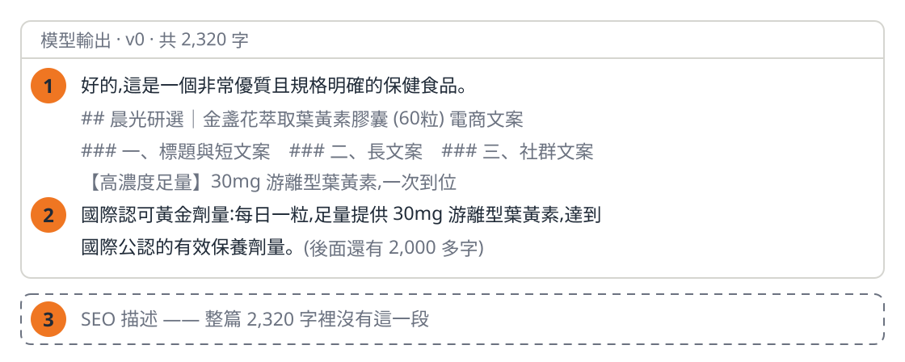
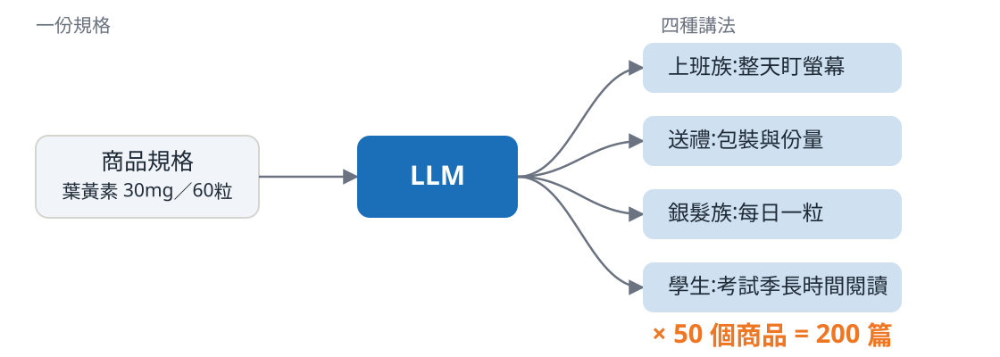

<!-- _class: title -->

# 從 Demo 到上線

零售生成式 AI 的 Prompt 與評測

Luka · 2026.08.21

<!--
銜接:全場起點。不寒暄、不自我介紹流水帳,講者身分留到第 5 頁之後帶一句。
封面本身即路標,本段不放 divider。停 5 秒讓標題被看見就往下。
核心提問「你怎麼知道它變好了?」不在封面,第 6 頁才第一次出現。
-->

---

## 同一個商品,哪一篇你會直接放上架?

### A 篇

**【晨光研選】高濃度游離型葉黃素膠囊｜晶亮守護神 60粒**

🌟 長時間面對螢幕,感到疲勞乾澀?

✨【高濃度足量】30mg 游離型葉黃素,一次到位

國際認可黃金劑量:每日一粒,達到國際公認的有效保養劑量。

💡 告別模糊!給你清晰新視界。

### B 篇

**晨光研選 游離型葉黃素膠囊 30mg高濃度配方 60粒**

採用游離型葉黃素,分子小好吸收,適合每日持續補充。

高濃度配方:每粒含足量葉黃素 30mg 及玉米黃素 6mg。

適合長時間使用電腦、手機的上班族,維持舒適晶亮。

<!--
不說它們的來歷,只說「同一個商品、同一個模型,差別只在 prompt」。
給台下 30 秒讀完,自己不要念稿;口述導讀「左邊有痛點有 emoji,右邊像上架資料」。
讀完再問「A 還是 B?請舉手」,**真的等票投完再翻頁** —— 票數不重要,分裂本身才是內容。
問句裡的「**直接**」是下一頁反轉的鉤子,唸的時候加重音:直接 = 不用有人回頭補。
票若一面倒向 B:「那你們比我遇過的多數團隊嚴格,不過請看下一頁。」
時間警戒:本頁含投票是全段最長的一頁,超過 100 秒就往下走。
-->

---

## 文案 A 可能的問題

### 1. 讀不到標題

開場白被當成標題。程式抓不到,這一步就自動化不了。

### 2. 賣點 45 字

超過通路上限 30 字,要人來重寫

### 3. 沒有 SEO 描述

整篇 2,320 字裡沒有,要人來補寫

50 個商品,150 次人工。

<!--
**措辭紀律**:標題只說「**可能的問題**」,口頭也不要升級成斷言。不是「不能上架」——
人拿著這篇 markdown 一樣能整理出可上架的文案;真正的代價是**每一條都得有人回頭補**。
講出口的版本是「這三個地方,自動化流程接不下去」,不是「這篇不能用」。
也**不要說「多數人選的那篇」**,那是在指責台下。說「其中一篇,有些問題不用投票就看得到」。
接住上一頁的「直接」:三條每一條都得有人回頭補,所以它上不了「直接」兩個字。
手指著螢幕依 1→2→3 走一遍,每點 10 秒;收在規模那句。法規風險留到 section-03。
-->

---

## 為什麼要讓它自動生成

### Netflix 也是這樣做

同一部影片準備多張主視覺,依觀看紀錄挑一張 Netflix Tech Blog《Artwork Personalization》,2017

### 規格與講法要分開

規格從資料庫來,錯了是資料問題 講法交給 LLM,錯了才是模型問題

<!--
先講 Netflix,再落回電商,這是台下最容易接上的類比。
出處要講出來:那是 Netflix 公開的作法,講的是**主視覺**;文字簡介的個人化沒有公開來源,不要順口帶過去。
LLM 在這裡負責的是「講法」,不是「規格」:規格錯了是資料問題,講法錯了才是模型問題。
一篇一篇寫,200 篇寫不完。要自動生成,就得先能判斷生出來的東西好不好。
-->

---

<!-- _class: center -->

# 沒有同一把尺

「比較好」檢驗不了

<!--
低密度頁,把剛才的情緒收下來,講慢一點。
關鍵句:「好」如果只能靠感覺,那「變好了」就永遠證明不了。
-->

---

<!-- _class: center -->

# 你怎麼知道它變好了?

<!--
全場第一次出現核心訊息,停三秒再說話。這裡帶一句自己的身分即可。
交棒:收在「要證明變好了,得先讓改動可以歸因」,直接接 section-02 的四版 prompt。
-->
