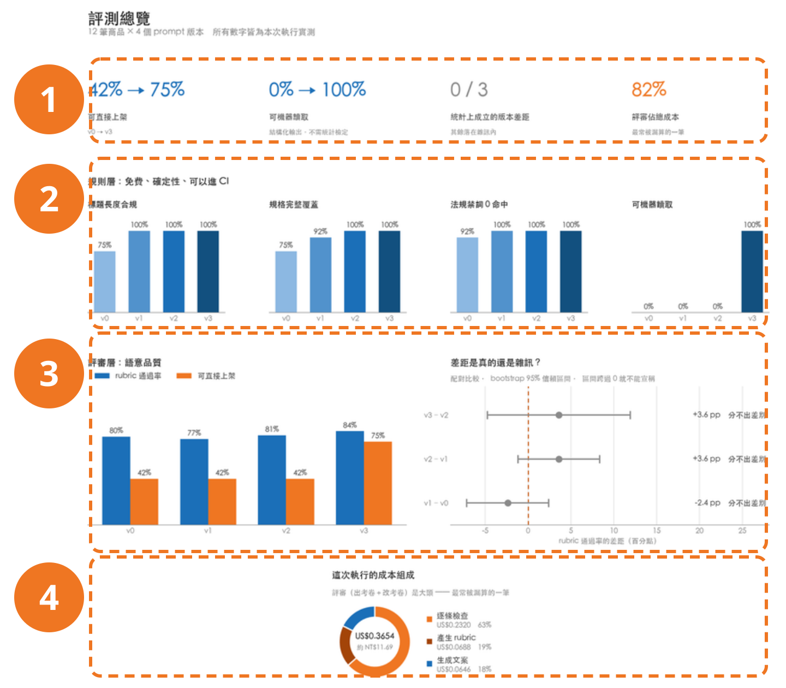

<!-- _class: divider bg-none -->

# 現場跑一次

同一份程式碼,同一批 fixtures

<!--
銜接:接上一段的「這些數字不是我畫在投影片上的」。直接說「現在跑一次」。
本段九分鐘,notebook 佔七分半 —— 投影片只負責進場、備援、收束。
-->

---

## 等一下三件事,而且全程不連網

- **生成**:同一個商品,v0 與 v3 並排
- **三層評測**:規則層對比表 → 違規細節 → rubric 逐條檢查
- **總覽儀表板**:前面所有數字畫成一頁

`OFFLINE_MODE = True`:重播事先對真實 API 錄好的 fixtures,零網路、零成本。
<u>同一份輸入,重跑得到同一份輸出。</u>

<!--
一定要講 OFFLINE_MODE,並說清楚它是為了**可重跑**,省錢只是順帶。
上台前確認:OFFLINE_MODE = True 且 RECORD_FIXTURES = False(兩者不能同時為 True)。
主動先講:notebook 是 12 個商品,真正的結論來自另外跑的 50 筆評測集。
-->

---

## 【備援】跑不動時,它跑出來長這樣

### 1. 四個關鍵數字

可直接上架、可機器讀取、統計成立幾段、評審佔多少成本

### 2. 規則層四張長條圖

v0→v3 同一藍由淺到深,版本是有序的

### 3. 評審層與顯著性

左:差多少。右:差距可不可信。

### 4. 成本環圈圖

評審佔大頭:出考卷 + 改考卷

<!--
**平常跳過這頁**,Colab 連不上才翻開,照 1→2→3→4 走一遍。
翻車處置:走完這頁時間反而會多出來,多的時間還給 QA。
螢幕上是 12 筆那輪的 US$0.3654;50 筆評測集那輪是 US$1.4987 —— 說的時候要分清楚。
-->

---

<!-- _class: center -->

# 剛剛那些數字,是跑出來的

同一條 pipeline。notebook 跑 12 筆,投影片那張表是 50 筆。

<!--
§3 跑到「最常沒過的判準」時要停一下:**那才是能拿去改 prompt 的東西**,通過率本身不能。
§6 儀表板出現時指著成本環圈口述:評審比生成貴,金額不上投影片。
交棒:收在「這套東西你今天就能開始做」,接 section-06。
-->
