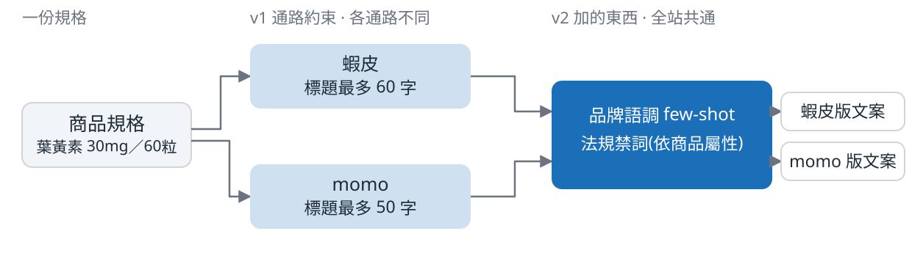
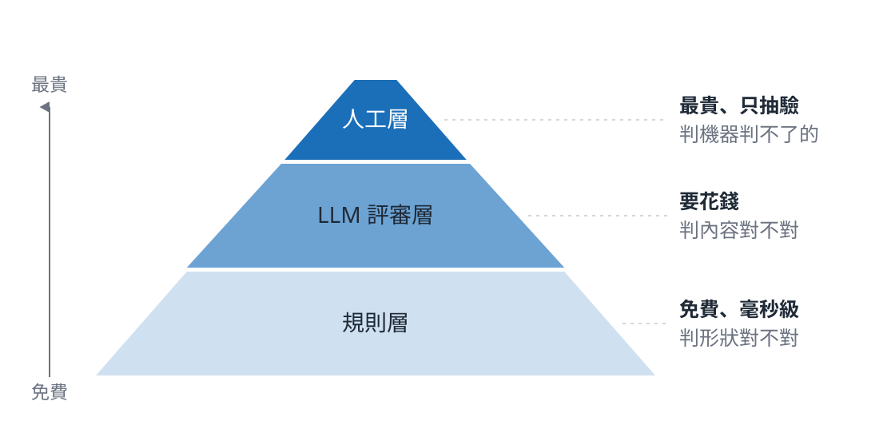
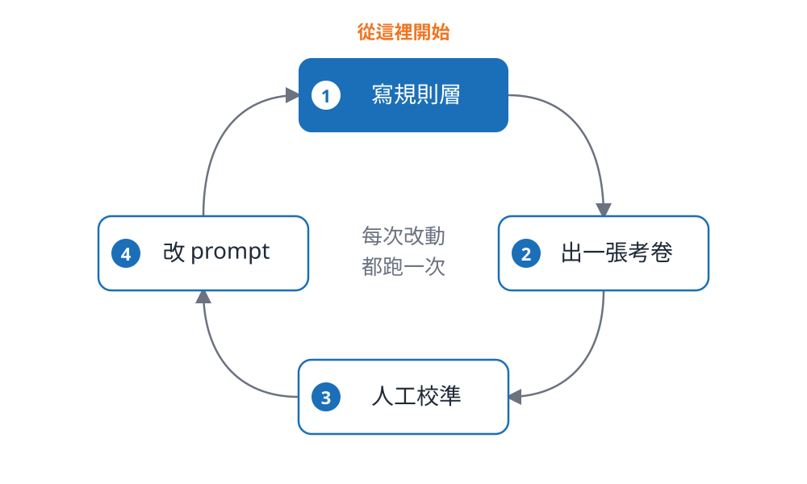

<!-- _class: title -->

# 從 Demo 到上線

零售生成式 AI 的 Prompt 與評測

Luka · 2026.08.21

<!--
銜接:全場起點。不寒暄、不自我介紹流水帳,講者身分留到第 5 頁之後帶一句。
封面本身即路標,本段不放 divider。停 5 秒讓標題被看見就往下。
核心提問「你怎麼知道它變好了?」不在封面,第 6 頁才第一次出現。
-->

---

## 同一個商品,哪一篇你會直接放上架?

<div class="cols-2">
<div>

### A 篇

<div class="card sample">

**【晨光研選】高濃度游離型葉黃素膠囊｜晶亮守護神 60粒**

🌟 長時間面對螢幕,感到疲勞乾澀?

✨【高濃度足量】30mg 游離型葉黃素,一次到位

國際認可黃金劑量:每日一粒,達到國際公認的有效保養劑量。

💡 告別模糊!給你清晰新視界。

</div>
</div>
<div>

### B 篇

<div class="card sample">

**晨光研選 游離型葉黃素膠囊 30mg高濃度配方 60粒**

採用游離型葉黃素,分子小好吸收,適合每日持續補充。

高濃度配方:每粒含足量葉黃素 30mg 及玉米黃素 6mg。

適合長時間使用電腦、手機的上班族,維持舒適晶亮。

</div>
</div>
</div>

<!--
不說它們的來歷,只說「同一個商品、同一個模型,差別只在 prompt」。
給台下 30 秒讀完,自己不要念稿;口述導讀「左邊有痛點有 emoji,右邊像上架資料」。
讀完再問「A 還是 B?請舉手」,**真的等票投完再翻頁** —— 票數不重要,分裂本身才是內容。
問句裡的「**直接**」是下一頁反轉的鉤子,唸的時候加重音:直接 = 不用有人回頭補。
票若一面倒向 B:「那你們比我遇過的多數團隊嚴格,不過請看下一頁。」
時間警戒:本頁含投票是全段最長的一頁,超過 100 秒就往下走。
-->

---

## 文案 A 可能的問題


<div class="cols-3">
<div>

### 1. 讀不到標題

<span class="small">開場白被當成標題。程式抓不到,這一步就自動化不了。</span>

</div>
<div>

### 2. 賣點 <span class="accent">45 字</span>

<span class="small">超過通路上限 30 字,要人來重寫</span>

</div>
<div>

### 3. 沒有 SEO 描述

<span class="small">整篇 2,320 字裡沒有,要人來補寫</span>

</div>
</div>

50 個商品,150 次人工。

<!--
**措辭紀律**:標題只說「**可能的問題**」,口頭也不要升級成斷言。不是「不能上架」——
人拿著這篇 markdown 一樣能整理出可上架的文案;真正的代價是**每一條都得有人回頭補**。
講出口的版本是「這三個地方,自動化流程接不下去」,不是「這篇不能用」。
也**不要說「多數人選的那篇」**,那是在指責台下。說「其中一篇,有些問題不用投票就看得到」。
接住上一頁的「直接」:三條每一條都得有人回頭補,所以它上不了「直接」兩個字。
手指著螢幕依 1→2→3 走一遍,每點 10 秒;收在規模那句。法規風險留到 section-03。
-->

---

## 為什麼要讓它自動生成


規格與講法分開:規格從資料庫來,錯了是資料問題;講法由 LLM 生成,錯了是模型問題。

<!--
左邊那份規格只有一份,右邊的文案有幾份取決於分幾種客群。
LLM 負責講法,規格仍從資料庫來 —— 規格錯了查資料,講法錯了才查模型。
一篇一篇寫,200 篇寫不完。要自動生成,就得先能判斷生出來的東西好不好。
四種客群是舉例,實際切幾種由行銷決定;數量一乘上去,人工就跟不上。
-->

---

<!-- _class: center -->

# 沒有同一把尺

「比較好」檢驗不了

<!--
低密度頁,把剛才的情緒收下來,講慢一點。
關鍵句:「好」如果只能靠感覺,那「變好了」就永遠證明不了。
-->

---

<!-- _class: center -->

# 你怎麼知道它變好了?

<!--
全場第一次出現核心訊息,停三秒再說話。這裡帶一句自己的身分即可。
交棒:收在「要證明變好了,得先讓改動可以歸因」,直接接 section-02 的四版 prompt。
-->

---

<!-- _class: divider bg-none -->

# prompt 是一份規格書

四個版本,每一版只加一件事

<!--
銜接:接住上一段的「A 篇不能上架」。這段先不解決判準問題,先解決歸因問題。
一句話開場:就算你有了判準,一次改三件事,量出來的差異也歸因不到任何一件事上。
-->

---

## v0 — 什麼都不給

```text
幫我寫這個商品的電商文案。

商品名稱：金盞花萃取葉黃素膠囊 60粒
品牌：晨光研選
分類：保健食品 / 眼部保養
售價：NT$890
規格：
  - 淨含量：60粒 / 盒
  - 主成分：游離型葉黃素 30mg、玉米黃素 6mg
  - 劑型：植物膠囊
  - 產地：台灣
  - 建議食用：每日1粒，隨餐食用
```

<!--
這是 v0 的**全文**,157 個字元 —— 全文放得進一頁,本身就是論點。
它是基準線,刻意保持這麼爛;不是稻草人。說出口:「這一版什麼都沒加。」
v0 是唯一佔兩頁的版本(prompt 全文 + 產出),因為它沒有「加了什麼」可以列。
時間警戒:v0 這兩頁素材有趣最容易講太久,合計壓在 60 秒內。
-->

---

## v0 的產出

<div class="card sample">

**【晨光研選】高濃度游離型葉黃素膠囊 (30mg)｜晶亮守護神 60粒**

🌟 您是否面臨這些困擾?長時間面對手機、電腦,感到疲勞乾澀?

✨ 【高濃度足量】30mg 游離型葉黃素,一次到位

國際認可黃金劑量:每日一粒,足量提供 30mg 游離型葉黃素,達到國際公認的有效保養劑量。

💡 每日一粒,告別模糊!給你清晰新視界。

<span class="small">共 2,320 字,涵蓋三個平台的文案</span>

</div>

<!--
就是第一段的 A 篇,喚起記憶即可,**不要重讀**。
一句話帶過:「它其實很努力 —— 它給了你三個平台的文案,只是沒有一個能用。」
-->

---

## v1 — 只加了通路約束

- **角色與受眾**:資深電商文案編輯,寫給長時間看螢幕的上班族
- **字數上限**:標題 60 字、賣點每條 30 字、SEO 描述 120 字
- **必含規格**:葉黃素、60粒、30mg 一個都不能少

<div class="card sample">

**晨光研選｜高濃度游離型葉黃素 30mg｜晶亮守護 60粒｜長時間螢幕族必備**

足量高濃度:每粒含游離型葉黃素 30mg,高效晶亮有感。

黃金比例:國際認證 5:1 比例,搭配玉米黃素,吸收更完整。

安心素食:台灣製造,採用植物膠囊,素食者也能安心食用。

<span class="small">標題 37 字。四條賣點 27–30 字。規格關鍵字全中。SEO 描述 124 字,上限 120。</span>

</div>

<!--
明講對應:第一段那三條,v1 修掉其中兩條(賣點長度、SEO 描述終於有了);
「讀不到標題」那條它沒修 —— 要等 v3。v1 是衝著「不用人回頭補」去的第一步。
說出口:「這一版只加了一件事。」**刻意不在這一版加法規**,理由下一頁講。
指出來:欄位標題是模型自己打的,不是我們要求的 —— 它還是一篇 markdown,不是資料。
-->

---

## 每個通路一條 pipeline



<span class="small">數字出自 `products.json` 的 `channel_limits`:蝦皮標題上限 60 字、momo 50 字;賣點 30 字、SEO 描述 120 字,兩邊相同。</span>

<!--
左邊那份規格只有一份,右邊的文案有幾份取決於上幾個通路。
v1 那段約束跟著通路換 —— 標題上限蝦皮 60、momo 50,同一份規格要生兩種長度。
v2 加的兩件事跟通路無關:品牌語調是自己的,法規禁詞看商品屬性。所以那一塊全站共用一份。
QA 防守:這輪只跑蝦皮那條;momo 的 50 字上限資料裡有,換的是數字不是規則層。
-->

---

## v2 — 只加了法規與語調

**為什麼不跟 v1 一起加?** 兩件事一起加,改動就對不回指標。

```text
【法規限制 — 這是硬性要求，違反會被開罰】
本商品受《食品安全衛生管理法》第 28 條規範，不可出現下列詞彙或其同義表達：
改善視力、增強免疫力、抗老、美白⋯⋯（依商品屬性帶入 60 個）

【品牌語調】溫和、專業、不誇大，訴求日常持續補充
範例 1（B群緩釋錠）標題：晨光研選 緩釋B群錠 90錠 每日一錠 全素可食
　　　　　　　　　賣點：8種B群一次補齊，緩釋設計
```

**v0**　每日一粒,<span class="accent">告別模糊</span>!給你清晰新視界。　　**v2**　適合長時間使用電腦、手機的上班族,幫助維持晶亮舒適。

<!--
螢幕上是**實際被接到 v1 後面的那段 prompt 原文**(節錄),不是我改寫的描述。
few-shot 給的是這個品牌自己既有的合規文案,一篇一組標題 + 賣點,prompt 裡共兩篇。
禁詞清單保健食品有 93 個,prompt 帶入前 60 個;細節與罰則留給 section-03。
「為什麼不跟 v1 一起加」是本頁的論點,不要跳過。本頁唯一 accent 給「告別模糊」。
-->

---

<!-- _class: tech -->

## v3 — 只加了結構化輸出

| 加在哪 | 加了什麼 | 有沒有約束力 |
|---|---|---|
| prompt | 「請直接輸出符合指定 schema 的 JSON」 | 沒有,模型可以忽略 |
| API 參數 | `response_mime_type` + `response_schema` | **有**,輸出被限制在 schema 內 |

```json
// 送進去的約束(一份 JSON Schema)
{ "type": "object",
  "properties": { "title": {"type":"string"}, "bullets": {"type":"array"},
                  "seo_description": {"type":"string"}, "hashtags": {"type":"array"} },
  "required": ["title","bullets","seo_description","hashtags"] }
// 吐出來的:{ "title": "晨光研選 游離型葉黃素膠囊 30mg高濃度配方 60粒", ⋯ }
```

<span class="small">structured output 是通用機制,JSON Schema 是公開標準 —— 換一家模型商,參數名不同,傳進去的東西一樣。</span>

<!--
台下最常問的就是「兩個都要嗎」:程式碼裡兩個都寫了,只有 API 參數有約束力。
被問「schema 長什麼樣」就指螢幕:那是一份 JSON Schema,型別 + 欄位 + required,跟語言和廠商無關。
prompt 那句是保險(擋 markdown code fence),拿掉它模型一樣會被 schema 綁住;拿掉 API 參數就全垮。
所以重點是:**不要用 prompt 硬凹 JSON**,要用 API 原生的 structured output。
QA 防守:**schema 保證的是形狀,不是長度** —— 欄位與型別受約束,字數仍要靠規則層檢查。
-->

---

## 四版,四件事


<!--
四個節點依序走一遍,每一版都再說一次「只加了一件事」—— 四次都說,那是本段記憶點。
交棒:收在「每一格改善都指得出是誰造成的 —— 前提是你量得出來」,接 section-03。
本段一個通過率都不放,忍住不要順手補數字。
-->

---

<!-- _class: divider bg-none -->

# 把「好」變成可量測的東西

三層評測,由便宜到貴

<!--
銜接:接上一段的「你量得出來嗎」。不再鋪陳,下一頁直接給金字塔。
提醒台下這是全場認知負荷最高的一段,第 10 頁會有喘息。
-->

---

## 三層,三個價位帶



<!--
由下往上走一遍:底層寬且免費、頂層窄且最貴 —— 梯度本身就是論點。
關鍵句:問題不是「要不要做評測」,是「這一種問題該花多少錢去判」。
-->

---

<!-- _class: tech -->

## 規則層:免費、毫秒級、可重跑

| 檢查 | 判什麼 |
|---|---|
| 可機器讀取 | 輸出是不是合法、能解析的 JSON |
| 標題長度 | 不超過 60 字 |
| 賣點長度 | 每條不超過 30 字 |
| SEO 描述長度 | 不超過 120 字 |
| 規格完整覆蓋 | 必含關鍵字有沒有全部出現 |
| 法規禁詞 0 命中 | 依商品屬性套用的禁詞清單 |

<span class="small">50 篇 × 6 條 = 300 次判斷,全在本機跑,不呼叫任何模型</span>

<!--
查閱型頁面,**不要逐條念**:指著說「六條、全是二元的、全在本機跑」就往下。
六條都是可重跑的確定性檢查 —— 同樣的輸入永遠得到同樣的判定,可以進 CI。
時間警戒:本頁壓在 40 秒內。
-->

---

## 其中一條擋的是 <span class="accent">60 萬到 500 萬</span> 的罰鍰

- **食安法 §28**:食品宣稱醫療效能,罰鍰 60 萬到 500 萬
- **依商品屬性套用**:保健食品走食安法,化粧品走化粧品衛管法
- **清單裡的實際詞**:改善視力、增強免疫力、抗老、美白

<span class="small">清單出自 `poc/data/banned_terms.json`,依主管機關公開認定準則的分類整理,不構成法律意見</span>

<!--
罰則講「60 萬到 500 萬」,不要簡化成「幾百萬」。禁詞的例子照 banned_terms.json 唸,不臨場編。
被問到清單準不準:照圖說那行答 —— 依主管機關公開認定準則的分類整理,不構成法律意見,商用要法務審。
全段情緒最高點,講到這裡放慢。
-->

---

<!-- _class: tech -->

## 評審層:每題只能答是或否

**二元 rubric**(每題只能答是或否的考卷):一組可以逐條檢查的 yes/no 問題。

| 維度 | 條 | 判準(只能答是或否) |
|---|---|---|
| 賣點覆蓋 | R1 | 文案是否提及 30mg 葉黃素為衛福部建議的每日最高攝取量? |
| 賣點覆蓋 | ★ R2 | 文案是否點出產品適合長時間使用電腦或手機的族群? |
| 賣點覆蓋 | R3 | 文案是否將「游離型」葉黃素的優點,連結到分子小或好吸收? |
| 品牌語調 | ★ R4 | 文案是否避免使用「立即見效」「保證有效」等過度承諾的詞語? |
| 品牌語調 | R5 | 文案是否完全未使用驚嘆號來製造強烈或促銷的語氣? |
| 消費者可讀性 | R6 | 文案是否點出「60粒」的包裝為兩個月份量? |
| 消費者可讀性 | R7 | 文案是否在標題之外,把「金盞花萃取葉黃素」簡稱為「葉黃素」? |

<span class="small">HB-1001 的完整清單,七條全在這裡,由商品資料生成,v0–v3 共用同一份。★ = critical,沒過就不進上架佇列。</span>

<!--
術語首現一定要附白話對照,說完「二元 rubric」立刻補「每題只能答是或否的考卷」。
七條全部出自實跑,來源是 poc/src/judge.py 的 generate_rubrics(HB-1001)。
**不要逐條念**:指著說「三個維度、七條、每條只能答是或否」,再挑兩條講。
挑 R5(驚嘆號)最有效 —— 品牌語調這種說不清楚的東西,也能寫成可勾選的一條。
時間警戒:本頁壓在 50 秒內。
-->

---

## 為什麼不用 1 到 5 分

| 維度 | 1–5 分 | 二元 |
|---|---|---|
| 鑑別度 | 分數擠在 3–4 分 | 過或不過 |
| 可重現 | 換一個模型整體平移 | 判準明確,重跑結果一致 |
| 可行動 | 「3.8 分」對應不到要改什麼 | 哪一條沒過就改哪裡 |

<!--
提到 Likert 用「1 到 5 分那種打分法」帶過,不預設台下知道那個名詞。
最關鍵的是第三列:分數不能行動,清單可以。
時間警戒:表格會忍不住逐格講,壓在 40 秒內。
-->

---

<!-- _class: center -->

# 四個版本,考同一張卷

rubric 只從商品資料生成,不看被評的文案

<!--
低密度,承上啟下。讓評審看著文案即興出題,等於每個版本考不同的卷子,四版之間就不能比。
講完停一下,下一頁是我在這裡跌過的坑。
-->

---

## 如果出了一張爛考卷

產生 rubric 的時候,我沒告訴它通路的字數預算。
於是它出了一條判準:**賣點要解釋成分原理** —— 30 字的賣點解釋不了原理。

修正前,愈囉嗦的版本分數愈高:<span class="accent">v0 拿 100%、v3 只有 57%</span>,完全顛倒。

<u>考卷歪掉的時候,分數也會變高。</u>

<!--
本場可信度最高的一頁,講慢一點。這是我自己出的錯,標題不掛「我」,但口頭要認。
說清楚:那兩個數字是我做錯的時候量到的舊值,不是現在的結果。
-->

---

## 生成與評審,刻意用不同的模型

- **生成**用 `gemini-flash-latest`:吞吐量大、單價低
- **評審**用 `gemini-2.5-pro`:與生成模型不同
- 要壓的是 **self-preference bias**(模型可能偏好自己寫出來的東西)

<!--
被問到「為什麼不用同一個模型省事」,答 self-preference bias,講得出名字就好。
這是我們的取捨:省下的是零頭,換掉的是結論的可信度。
-->

---

<!-- _class: center -->

# 這篇能不能上架

三層評測都在回答這一個問題

<!--
全場正式喘息頁,認知峰值後的降壓,停三秒。
這三層都不是在給文案打分數,是在回答一個可以行動的問題。
交棒:收在「工具有了,現在來看四個版本量出來的結果」,接 section-04。
-->

---

<!-- _class: divider bg-none -->

# 四個版本量出來的結果

規則層與評審層各量到什麼

<!--
銜接:接上一段的「工具有了」。下一頁直接上數字,不重述三層是什麼。
先講一句:接下來這五分鐘,我會把剛剛那套方法論用在我自己的數字上。
-->

---

<!-- _class: tech -->

## 六條全過的,從 0 篇變成 <span class="accent">49 篇</span>

| 規則 | v0 | v1 | v2 | v3 |
|---|---|---|---|---|
| 可機器讀取 | 0% | 0% | 0% | 100% |
| 標題長度 | 74% | 100% | 100% | 100% |
| 賣點長度 | — | — | — | 98% |
| SEO 描述長度 | — | — | — | 100% |
| 規格完整覆蓋 | 82% | 98% | 100% | 100% |
| 法規禁詞 0 命中 | 80% | 98% | 100% | 100% |
| 六條全數通過 | 0% | 0% | 0% | 98% |

<span class="small">50 篇評測集。可機器讀取是門檻:v0–v2 那一格 0%,其餘幾條再高也過不了。「—」= 量不到,沒有 schema,parser 猜不出賣點與描述在哪。v3 的 98% 是 50 篇裡 49 篇,唯一沒過的那篇卡在賣點長度。</span>

<!--
前三版全部卡在同一格:可機器讀取 0%。v3 一次把它補上。
台下最可能問的是「v2 三個 100% 為什麼全數通過是 0%」:指第一列,可機器讀取 0% 就一票否決。
實際擋住 v2 的有三條:可機器讀取 0%、賣點長度 50%、SEO 0%,後兩條標「—」因為量到的是 parser。
時間警戒:本頁壓 40 秒,把時間留給第 4 頁。
-->

---

## 評審層:v0 → v2 上升,v3 下降

| 版本 | rubric 通過率 | 可直接上架 | critical 違反數 |
|---|---|---|---|
| v0 | 73.1% | 32% | 27 |
| v1 | 78.0% | 48% | 18 |
| v2 | 86.8% | 64% | 9 |
| v3 | 85.4% | 62% | 13 |

<span class="small">50 篇評測集 · rubric 每篇 7 條 · 評審模型 gemini-2.5-pro</span>

<!--
**主動指出 v3 那格是往下的**,不要等台下發現。一張每格都完美遞增的表,通常代表有人在調數字。
v3 掉的是 rubric(−1.4pp,在雜訊內),換到的是可機器讀取:50 篇裡 0 篇 → 50 篇。
三段差距只有 v1 → v2 站得住(+8.86pp,95% CI [+4.57, +13.15]),另外兩段的區間都跨過 0。
措辭:區間跨過 0 是「還沒有證據說誰比較好」,不要講成「兩版一樣好」。
交棒:收在「這些數字不是我畫在投影片上的,現在跑一次給你看」,接 section-05。
-->

---

<!-- _class: divider bg-none -->

# 現場跑一次

同一份程式碼,同一批 fixtures

<!--
銜接:接上一段的「這些數字不是我畫在投影片上的」。直接說「現在跑一次」。
本段九分鐘,notebook 佔七分半 —— 投影片只負責進場、備援、收束。
-->

---

## 等一下三件事,而且全程不連網

- **生成**:同一個商品,v0 與 v3 並排
- **三層評測**:規則層對比表 → 違規細節 → rubric 逐條檢查
- **總覽儀表板**:前面所有數字畫成一頁

`OFFLINE_MODE = True`:重播事先對真實 API 錄好的 fixtures,<span class="accent">零網路、零成本</span>。
<u>同一份輸入,重跑得到同一份輸出。</u>

<!--
一定要講 OFFLINE_MODE,並說清楚它是為了**可重跑**,省錢只是順帶。
上台前確認:OFFLINE_MODE = True 且 RECORD_FIXTURES = False(兩者不能同時為 True)。
主動先講:notebook 是 12 個商品,真正的結論來自另外跑的 50 筆評測集。
-->

---

## 【備援】跑不動時,它跑出來長這樣

<div class="cols-2">
<div>


</div>
<div>

### 1. 四個關鍵數字

<span class="small">可直接上架、可機器讀取、統計成立幾段、評審佔多少成本</span>

### 2. 規則層四張長條圖

<span class="small">v0→v3 同一藍由淺到深,版本是有序的</span>

### 3. 評審層與顯著性

<span class="small">左:差多少。右:差距可不可信。</span>

### 4. 成本環圈圖

<span class="small">評審佔大頭:出考卷 + 改考卷</span>

</div>
</div>

<!--
**平常跳過這頁**,Colab 連不上才翻開,照 1→2→3→4 走一遍。
翻車處置:走完這頁時間反而會多出來,多的時間還給 QA。
螢幕上是 12 筆那輪的 US$0.3654;50 筆評測集那輪是 US$1.4987 —— 說的時候要分清楚。
-->

---

<!-- _class: center -->

# 剛剛那些數字,是跑出來的

同一條 pipeline。notebook 跑 12 筆,投影片那張表是 50 筆。

<!--
§3 跑到「最常沒過的判準」時要停一下:**那才是能拿去改 prompt 的東西**,通過率本身不能。
§6 儀表板出現時指著成本環圈口述:評審比生成貴,金額不上投影片。
交棒:收在「這套東西你今天就能開始做」,接 section-06。
-->

---

<!-- _class: divider bg-none -->

# 第一個評測迴圈

三個步驟,都先做最小的版本

<!--
銜接:接上一段的「這套東西你今天就能開始做」。下一頁直接給迴圈圖。
本段刻意零新名詞 —— 前面沒出現過的詞都不要在這裡冒出來。
-->

---

## 每次改動都跑一次



<!--
從編號 1 順時針走一遍,強調箭頭是**回到起點**的:評測不是專案結束前的關卡。
一句話:每次改動 prompt 都要跑一次,不然你不知道改動有沒有效。
-->

---

## 第一步:規則層

- **長度**:標題、賣點、描述各自的上限
- **必含關鍵字**:規格不能漏
- **禁詞**:依商品屬性套用

這一層 <span class="accent">免費</span>、可重跑。<u>規則判得動的部分,不必送模型。</u>

<!--
最小可行版本:從最痛的三條開始,不必一次寫六條。
這一層的成本是零,所以它是唯一沒有理由不做的一層。
-->

---

## 第二步:出一張所有版本共用的考卷

- **二元**:每題只能答是或否
- **共用**:所有版本考同一張卷
- **生成時附上通路限制**:字數預算要寫進去

<!--
最小可行版本:十題就夠,不用一開始就追求完整。
第三點一句話回指前面的爛考卷即可,**不要重講一次**。
-->

---

## 第三步:人工只補機器判不了的

- **語調**:像不像這個品牌講話
- **說服力**:賣點有沒有讓人想買
- **抽驗**:人工只做校準

<!--
最小可行版本:抽驗二十筆,對照機器的判定,看兩邊在哪裡不一致。
不一致的地方就是規則或 rubric 要修的地方 —— 那才是人工最值錢的用法。
-->

---

## 「生成得不好」有三種

| 哪一種不好 | 誰抓得到 | 怎麼修 |
|---|---|---|
| **形狀錯** 欄位缺、超長、不是 JSON | 規則層 | 開 structured output |
| **內容錯** 規格寫錯、賣點空洞 | 評審層 | 回頭改 prompt |
| **法規錯** 療效宣稱 | 規則層 | 設成硬性阻擋 |

<!--
本段最有價值的一頁,不要因為在最後就趕,三種各給一個具體例子。
三列直接對應前面的金字塔。碰到「AI 寫得不好」的第一反應常是換模型,
但這三種裡沒有一種是換模型能修的 —— 先分辨,再決定動哪裡。
-->

---

<!-- _class: center -->

# 你怎麼知道它變好了?

<!--
**停三秒再說話。** 這句話在第一段出現過一次,現在它有答案了。
與 section-01 末頁同句同版型,首尾呼應。
時間警戒:前面若超時,可壓縮的是第 3–5 頁,第 6、7 頁不能砍。
-->

---

## 謝謝

四版 prompt、六條規則、rubric 產生器與離線 fixtures 都在同一個 repo,離線可跑。

<span class="small">這份投影片上的數字,都是那個 repo 跑出來的。</span>

<!--
上台前把「取得方式」換成實際連結或 QR code,不要留這句籠統的話。
QA 停在這頁。備而不用的彈藥:成本外推、90 天導入路徑、信賴區間怎麼算、中文 token 密度。
收尾:不要再補新內容,問答結束就停。
-->
